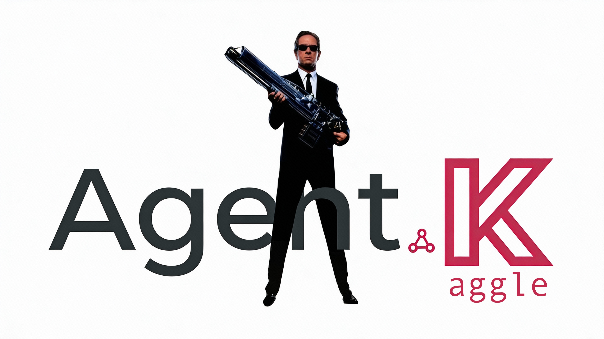

<div align="center">
  
  <h1>AGENT-K Backend</h1>
  <h3>Multi-Agent Kaggle GrandMaster (🧐)</h3>
  <p><em>Python multi-agent system for autonomous Kaggle competition participation</em></p>
</div>

<div align="center">
  <a href="https://www.python.org/downloads/"></a>
  <a href="https://ai.pydantic.dev/"></a>
  <a href="https://pydantic.dev/logfire"></a>
</div>

---

## Overview

The AGENT-K backend is a Python package implementing a multi-agent system for autonomous Kaggle competition participation. Built on Pydantic-AI and Pydantic-Graph, it coordinates specialized agents through a state machine to discover competitions, conduct research, prototype solutions, evolve optimizations, and submit entries.

The orchestrator will use the Kaggle API when credentials are available; otherwise it falls back to the in-memory OpenEvolve adapter for offline runs.

The backend follows the SAGE spec (Structured Agent Guidance Embeddings) for structured
docstrings and parameter metadata. The upstream spec lives at
[github.com/mikewcasale/sage-spec](https://github.com/mikewcasale/sage-spec), with a local
snapshot in `docs/sage-spec.md`.

---

## SAGE Spec (Structured Agent Guidance Embeddings)

SAGE provides structured, machine-readable guidance for both agents and human reviewers. In
this codebase it is used in three main places:

- Docstrings include SAGE tags such as `@notice`, `@dev`, `@graph`, `@agent-guidance`, and
  `@human-review` to capture the Contextual Relationship Graph (CRG).
- Parameter metadata is co-located with signatures using `typing.Annotated` plus
  `Doc`/`Range`/`Constraint`/`Default` from `agent_k.core.sage` (`agent_k/core/sage.py`).
- Machine-readable exports live in `backend/.sage/` (for example `components.json`,
  `canonical-homes.json`, and `errors.json`) to support tooling and fast lookups without scanning
  the full tree.

Developer workflow:
- Use the SAGE Docstrings VS Code extension (https://marketplace.visualstudio.com/items?itemName=gcode-ai.sage-vscode-extension) for tag templates and validation.
- Refresh `.sage` artifacts before committing:
  `backend/.venv/bin/python backend/tools/sageextract.py --emit` (pre-commit runs validation).

---

## Installation

### Using pip

```bash
cd backend
pip install -e .
```

### Using uv (recommended)

```bash
cd backend
uv sync

# Optional: install in editable mode
uv pip install -e .
```

### Dependencies

Core dependencies from `pyproject.toml`:

- `pydantic-ai>=0.2.0` - Agent framework
- `pydantic-graph>=0.2.0` - State machine orchestration
- `fastapi>=0.115.0` - API server for AG-UI
- `uvicorn>=0.32.0` - ASGI server
- `logfire>=0.44.0` - Observability and tracing
- `httpx>=0.27.0` - Async HTTP client
- `opentelemetry-api>=1.27.0` - Telemetry instrumentation
- `numpy>=1.26.0` - Numerical utilities

---

## Package Structure

```
agent_k/
├── __init__.py                 # Package exports
├── __main__.py                 # CLI entry point
├── _version.py                 # Version singleton
│
├── agents/                     # Pydantic-AI agent definitions
│   ├── base.py                 # Base agent patterns
│   ├── lobbyist.py             # Competition discovery
│   ├── scientist.py            # Research and analysis
│   ├── evolver.py              # Solution optimization
│   ├── lycurgus.py             # Orchestration
│   └── prompts.py              # System prompts
│
├── adapters/                   # Platform integrations
│   ├── kaggle.py               # Kaggle platform adapter
│   └── openevolve.py           # OpenEvolve in-memory adapter
│
├── core/                       # Domain primitives
│   ├── constants.py            # Domain constants
│   ├── data.py                 # Dataset helpers
│   ├── deps.py                 # Shared dependency containers
│   ├── exceptions.py           # Exception hierarchy
│   ├── models.py               # Core Pydantic models
│   ├── protocols.py            # Interface definitions
│   ├── settings.py             # Shared settings
│   ├── solution.py             # Solution execution helpers
│   ├── sage.py                 # SAGE docstring metadata helpers
│   └── types.py                # Type aliases
│
├── mission/                    # State machine
│   ├── nodes.py                # Phase nodes (Discovery, Research, etc.)
│   ├── state.py                # Mission state models
│   └── persistence.py          # Checkpoint management
│
├── toolsets/                   # Agent tools
│   ├── kaggle.py               # Kaggle toolset
│   ├── search.py               # Web search helpers
│   ├── memory.py               # Memory backend helpers
│   ├── code.py                 # Code execution helpers
│   ├── browser.py              # Placeholder for browser automation
│   └── scholarly.py            # Placeholder for scholarly search
│
├── embeddings/                 # RAG support
│   ├── embedder.py             # Embedding utilities
│   ├── retriever.py            # Retrieval logic
│   └── store.py                # Vector store helpers
│
├── evals/                      # Evaluation framework
│   ├── datasets.py             # Dataset definitions
│   ├── evaluators.py           # Evaluation logic
│   ├── discovery.yaml          # Sample eval cases
│   ├── evolution.yaml          # Sample eval cases
│   └── submission.yaml         # Sample eval cases
│
├── ui/                         # AG-UI protocol
│   └── agui.py                # FastAPI app and event emitter
│
└── infra/                      # Infrastructure
    ├── config.py               # Configuration management
    ├── providers.py            # Model provider configuration
    ├── logging.py              # Logging helpers
    └── instrumentation.py      # Logfire setup
```

---

## Agents

### LYCURGUS (Orchestrator | Law Giver)

The central orchestrator coordinating the multi-agent competition lifecycle. Implements a state machine using `pydantic-graph` to manage phase transitions.

```python
from agent_k import LycurgusOrchestrator

orchestrator = LycurgusOrchestrator(model="anthropic:claude-sonnet-4-5")
```

### LOBBYIST (Discovery)

Discovers and evaluates Kaggle competitions matching user-specified criteria.

```python
from agent_k import lobbyist_agent

result = await lobbyist_agent.run(
    "Find featured competitions with $10k+ prize",
    deps=deps,
)
```

### SCIENTIST (Research)

Conducts comprehensive research including literature review, leaderboard analysis, and EDA.

```python
from agent_k import scientist_agent

report = await scientist_agent.run(
    "Analyze this tabular competition",
    deps=deps,
)
```

### EVOLVER (Optimization)

Evolves solutions using evolutionary code search to maximize competition score.

```python
from agent_k import evolver_agent

result = await evolver_agent.run(
    "Optimize this LightGBM solution",
    deps=deps,
)
```

---

## Usage

### Basic Mission Execution

```python
import asyncio
from agent_k import LycurgusOrchestrator
from agent_k.core.models import MissionCriteria, CompetitionType

async def main():
    # Configure mission criteria
    criteria = MissionCriteria(
        target_competition_types=frozenset({
            CompetitionType.FEATURED,
            CompetitionType.RESEARCH,
        }),
        min_prize_pool=10000,
        min_days_remaining=14,
        target_domains=frozenset({"computer_vision", "nlp"}),
        max_evolution_rounds=100,
        target_leaderboard_percentile=0.10,
    )

    # Execute mission
    async with LycurgusOrchestrator() as orchestrator:
        result = await orchestrator.execute_mission(
            competition_id="titanic",
            criteria=criteria,
        )

        print(f"Success: {result.success}")
        print(f"Final Rank: {result.final_rank}")
        print(f"Final Score: {result.final_score}")
        print(f"Generations: {result.evolution_generations}")

asyncio.run(main())
```

### Configuration from File

`LycurgusSettings.from_file()` expects a JSON file.

```python
from pathlib import Path
from agent_k import LycurgusOrchestrator

orchestrator = LycurgusOrchestrator.from_config_file(
    Path("config/mission.json")
)
```

---

## Configuration

### Environment Variables

| Variable | Description | Required |
|----------|-------------|----------|
| `KAGGLE_USERNAME` | Kaggle account username | Yes* |
| `KAGGLE_KEY` | Kaggle API key | Yes* |
| `ANTHROPIC_API_KEY` | Anthropic API key for Claude models | Yes** |
| `OPENROUTER_API_KEY` | OpenRouter API key | Yes** |
| `OPENAI_API_KEY` | OpenAI API key | Yes** |
| `DEVSTRAL_BASE_URL` | Local LM Studio endpoint | No |
| `LOGFIRE_TOKEN` | Pydantic Logfire token | No |
| `AGENT_K_MEMORY_DIR` | Memory tool storage path | No |

*Required for Kaggle platform access. If absent, the orchestrator falls back to OpenEvolve.

**At least one model provider API key is required.

### Setting Environment Variables

```bash
export ANTHROPIC_API_KEY="your-api-key"
export OPENROUTER_API_KEY="your-openrouter-key"
export OPENAI_API_KEY="your-openai-key"
export KAGGLE_USERNAME="your-kaggle-username"
export KAGGLE_KEY="your-kaggle-key"
export LOGFIRE_TOKEN="your-logfire-token"  # Optional
```

---

## Development

### Running Tests

```bash
cd backend

uv run pytest -v
uv run pytest tests/test_file.py -v
```

### Linting and Formatting

```bash
cd backend

uv run ruff check .
uv run ruff format .
uv run mypy .
```

### Pre-Commit (Backend)

```bash
cd backend
uv run ruff format .
uv run ruff check .
backend/.venv/bin/python backend/tools/sageextract.py --emit
backend/.venv/bin/python backend/tools/sageextract.py --validate
uv run pytest -v --tb=short
```

---

## Observability

AGENT-K uses Pydantic Logfire for comprehensive observability:

```python
from agent_k.infra.instrumentation import configure_instrumentation

configure_instrumentation(
    service_name="agent-k",
    environment="production",
)
```

---

## Documentation

MkDocs source lives in `docs/` (including `docs/logo.png`), with build settings in
`mkdocs.yml`. The SAGE spec snapshot is stored in `docs/sage-spec.md` and the upstream source is
available at [github.com/mikewcasale/sage-spec](https://github.com/mikewcasale/sage-spec).

---

## License

MIT License - see [LICENSE](../LICENSE) for details.
