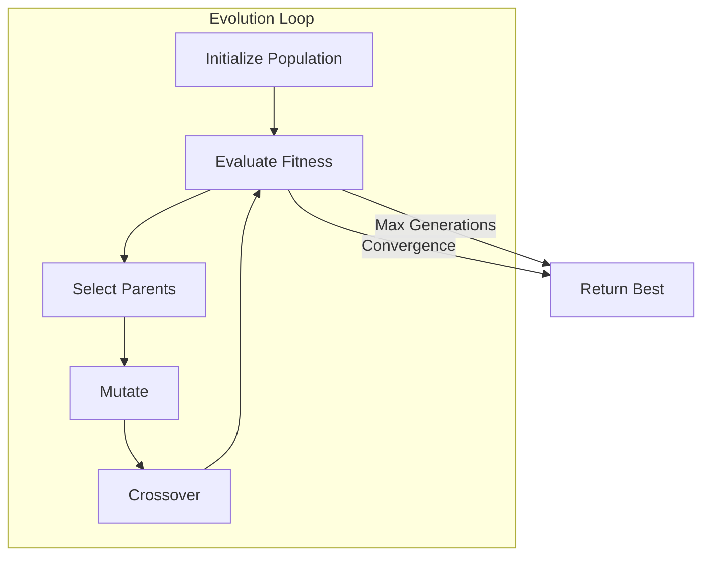

# EVOLVER — Optimization Agent

The EVOLVER agent optimizes solutions through evolutionary code search. Using population-based methods, it evolves code to maximize fitness (competition score).

## Role

- Initialize population from prototype
- Evaluate candidate fitness
- Apply mutations and crossover
- Track best solutions
- Detect convergence

## Architecture



## Builtin Tools

| Tool | Purpose |
|------|---------|
| `CodeExecutionTool` | Execute and evaluate solutions |
| `MemoryTool` | Store/retrieve evolution context |
| `MCPServerTool` (Kaggle) | Submit and inspect leaderboard |

## Basic Usage

```python
from agent_k.agents.evolver import EvolverDeps, evolver_agent
from agent_k.ui.ag_ui import EventEmitter

# Create dependencies
competition = await kaggle_adapter.get_competition("titanic")
deps = EvolverDeps(
    competition=competition,
    event_emitter=EventEmitter(),
    initial_solution="print('baseline')",
    max_generations=100,
    target_score=0.90,
)

# Run evolution
run_result = await evolver_agent.run(
    prompt="""
    Evolve the prototype solution to achieve fitness > 0.90.
    
    Use evolutionary strategies:
    - Mutation: Small code changes
    - Crossover: Combine good solutions
    - Selection: Tournament selection
    """,
    deps=deps,
)

output = run_result.output
print(f"Best fitness: {output.best_fitness}")
```

## Evolution Process

### 1. Initialize Population

```python
def initialize_population(
    prototype: str,
    population_size: int,
) -> list[Individual]:
    """Create initial population from prototype."""
    population = [Individual(code=prototype, fitness=None)]
    
    # Generate variants
    for _ in range(population_size - 1):
        variant = apply_random_mutation(prototype)
        population.append(Individual(code=variant, fitness=None))
    
    return population
```

### 2. Evaluate Fitness

```python
@toolset.tool
async def evaluate_fitness(
    code: str,
    competition_id: str,
) -> dict[str, Any]:
    """Evaluate solution fitness."""
    # Execute code in sandbox
    result = await sandbox.execute(code, train_data, test_data)
    
    return {
        "fitness": result.score,
        "execution_time": result.time_ms,
        "memory_usage": result.memory_mb,
        "error": result.error,
    }
```

### 3. Select Parents

Tournament selection:

```python
def tournament_selection(
    population: list[Individual],
    tournament_size: int = 3,
) -> Individual:
    """Select parent via tournament."""
    contestants = random.sample(population, tournament_size)
    return max(contestants, key=lambda x: x.fitness)
```

### 4. Apply Mutations

Types of mutations:

```python
class MutationType(Enum):
    POINT = "point"           # Small parameter changes
    STRUCTURAL = "structural" # Add/remove components
    HYPERPARAMETER = "hyper"  # Tune model settings
    FEATURE = "feature"       # Modify feature engineering

async def mutate(
    individual: Individual,
    mutation_type: MutationType,
) -> Individual:
    """Apply mutation to individual."""
    if mutation_type == MutationType.POINT:
        return await apply_point_mutation(individual)
    elif mutation_type == MutationType.STRUCTURAL:
        return await apply_structural_mutation(individual)
    # ...
```

### 5. Crossover

Combine good solutions:

```python
async def crossover(
    parent1: Individual,
    parent2: Individual,
) -> Individual:
    """Combine two parents into child."""
    # Extract components from each parent
    features1 = extract_features(parent1.code)
    model1 = extract_model(parent1.code)
    
    features2 = extract_features(parent2.code)
    model2 = extract_model(parent2.code)
    
    # Combine best components
    child_code = combine(
        features=random.choice([features1, features2]),
        model=random.choice([model1, model2]),
    )
    
    return Individual(code=child_code, fitness=None)
```

### 6. Detect Convergence

```python
def check_convergence(
    history: list[float],
    threshold: float,
    generations: int,
) -> tuple[bool, str]:
    """Check if evolution has converged."""
    if len(history) < generations:
        return False, ""
    
    recent = history[-generations:]
    improvement = max(recent) - min(recent)
    
    if improvement < threshold:
        return True, "no_improvement"
    
    return False, ""
```

## Evolver Settings

```python
from pydantic import Field
from pydantic_ai import ModelSettings
from pydantic_settings import BaseSettings, SettingsConfigDict

from agent_k.core.constants import DEFAULT_MODEL, EVOLUTION_POPULATION_SIZE, MAX_EVOLUTION_GENERATIONS


class EvolverSettings(BaseSettings):
    """Configuration for the Evolver agent."""

    model_config = SettingsConfigDict(
        env_prefix='EVOLVER_',
        env_file='.env',
        extra='ignore',
        validate_default=True,
    )

    model: str = Field(default=DEFAULT_MODEL, description='Model identifier for evolution tasks')
    temperature: float = Field(default=0.7, ge=0.0, le=2.0, description='Sampling temperature')
    max_tokens: int = Field(default=4096, ge=1, description='Maximum tokens for responses')

    tool_retries: int = Field(default=3, ge=0, description='Tool retry attempts')
    output_retries: int = Field(default=2, ge=0, description='Output validation retry attempts')

    population_size: int = Field(default=EVOLUTION_POPULATION_SIZE, ge=1, description='Population size')
    max_generations: int = Field(default=MAX_EVOLUTION_GENERATIONS, ge=1, description='Max generations')
    convergence_threshold: int = Field(default=5, ge=1, description='Generations without improvement')

    enable_thinking: bool = Field(default=True, description='Enable extended reasoning mode')
    thinking_budget_tokens: int = Field(default=4096, ge=0, description='Thinking token budget')

    @property
    def model_settings(self) -> ModelSettings:
        """Build ModelSettings from configuration."""
        return ModelSettings(
            temperature=self.temperature,
            max_tokens=self.max_tokens,
        )
```

## Output Model

```python
class EvolutionState(BaseModel):
    """Evolution state and results."""
    
    current_generation: int
    population_size: int
    
    best_solution: Solution
    best_fitness: float
    
    generation_history: list[GenerationMetrics]
    
    convergence_detected: bool
    convergence_reason: str | None = None
    
    total_evaluations: int
    elapsed_time_ms: int

class GenerationMetrics(BaseModel):
    """Metrics for a single generation."""
    
    generation: int
    best_fitness: float
    mean_fitness: float
    std_fitness: float
    worst_fitness: float
    
    mutations_applied: int
    crossovers_applied: int
    elite_preserved: int
```

## Agent Instructions

```python
def get_evolver_instructions() -> str:
    return """You are the EVOLVER agent in the AGENT-K system.

Your mission is to optimize a solution through evolutionary code search.

AVAILABLE TOOLS:
1. memory - Get prototype and research findings (view)
2. evaluate_fitness - Evaluate a solution's score
3. validate_code - Check code validity before evaluation

EVOLUTION STRATEGY:
1. Initialize population from prototype
2. Evaluate fitness of all individuals
3. Select parents via tournament selection
4. Apply mutations:
   - Point: Change hyperparameters
   - Structural: Add/remove model components
   - Feature: Modify feature engineering
5. Apply crossover to combine good solutions
6. Preserve elite (top N unchanged)
7. Repeat until convergence or max generations

MUTATION TYPES:
- Learning rate: ±10-50%
- Max depth: ±1-3
- Number of estimators: ±10-50
- Feature selection: Add/remove features
- Preprocessing: Change scaling method

CONVERGENCE CRITERIA:
- Target fitness achieved
- No improvement for N generations
- Max generations reached
- Time limit exceeded

OUTPUT:
Return best solution with fitness and evolution history.
"""
```

## Event Emission

The EVOLVER emits detailed events:

```python
# Generation complete
await emitter.emit_evolution_progress(
    generation=gen,
    best_fitness=best.fitness,
    mean_fitness=mean_fitness,
    evaluations=total_evals,
)

# New best found
await emitter.emit_new_best(
    generation=gen,
    fitness=new_best.fitness,
    improvement=improvement,
)

# Convergence
await emitter.emit_convergence(
    generation=gen,
    reason=convergence_reason,
    final_fitness=best.fitness,
)
```

## Fitness Landscape Visualization

Track fitness over generations for the dashboard:

```python
history = []

for gen in range(max_generations):
    fitnesses = [ind.fitness for ind in population]
    
    history.append(GenerationMetrics(
        generation=gen,
        best_fitness=max(fitnesses),
        mean_fitness=mean(fitnesses),
        std_fitness=std(fitnesses),
        worst_fitness=min(fitnesses),
    ))
```

## Integration with OpenEvolve

AGENT-K can integrate with OpenEvolve for advanced evolution:

```python
from agent_k.adapters.openevolve import OpenEvolveAdapter

adapter = OpenEvolveAdapter(
    api_url="http://openevolve:8080",
)

# Submit evolution job
job_id = await adapter.submit_evolution(
    prototype=prototype_code,
    fitness_function=fitness_fn,
    config=evolution_config,
)

# Poll for results
while True:
    status = await adapter.get_status(job_id)
    if status.complete:
        break
    await asyncio.sleep(5)

# Get best solution
best = await adapter.get_best_solution(job_id)
```

## Integration with LYCURGUS

```python
@dataclass
class EvolutionNode(BaseNode[MissionState, MissionResult]):
    evolver_agent: Agent
    
    async def run(self, ctx: ...) -> SubmissionNode | End[MissionResult]:
        # Run evolution
        result = await self.evolver_agent.run(
            prompt=self._build_prompt(ctx.state),
            deps=deps,
        )
        
        # Update state
        ctx.state.evolution_state = result.data
        
        # Check for viable solution
        if result.data.best_fitness >= ctx.state.criteria.min_viable_score:
            return SubmissionNode(solution=result.data.best_solution)
        
        # No viable solution
        return End(MissionResult(success=False, ...))
```

## API Reference

See [API Reference: EVOLVER](../api/agents/evolver.md) for complete documentation.
