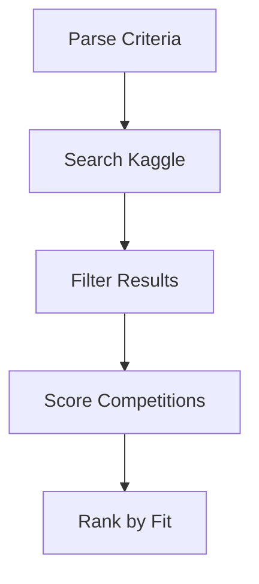

# LOBBYIST - Discovery Agent

The LOBBYIST agent discovers and evaluates Kaggle competitions that match user criteria. It acts as a scout, searching the competition landscape and ranking candidates by fit.

## Role

- Search Kaggle for active competitions
- Apply criteria filters
- Score and rank competitions
- Return a structured discovery result

## Tools

| Tool | Purpose |
|------|---------|
| `search_kaggle_competitions` | Query competitions through the platform adapter |
| `get_competition_details` | Fetch competition metadata |
| `score_competition_fit` | Rank competitions by criteria |
| `kaggle_*` toolset | Kaggle API helper tools |
| `web_search` (builtin) | Web discovery for recency/context |
| `memory` (builtin) | Shared notes (Anthropic only) |

## Basic Usage

```python
from agent_k.agents.lobbyist import LobbyistDeps, lobbyist_agent
from agent_k.adapters.kaggle import KaggleAdapter, KaggleSettings
from agent_k.ui.ag_ui import EventEmitter
import httpx

async with httpx.AsyncClient() as http:
    config = KaggleSettings(
        username="your_kaggle_username",
        api_key="your_kaggle_api_key",
    )
    kaggle_adapter = KaggleAdapter(config)
    deps = LobbyistDeps(
        http_client=http,
        platform_adapter=kaggle_adapter,
        event_emitter=EventEmitter(),
    )

    run_result = await lobbyist_agent.run(
        "Find featured competitions with $10k+ prize and 14+ days remaining",
        deps=deps,
    )

    output = run_result.output
    print(f"Found {len(output.competitions)} competitions")
```

## Discovery Process



## Dependencies

```python
from dataclasses import dataclass, field
from typing import Any
import httpx

@dataclass
class LobbyistDeps:
    """Dependencies for the LOBBYIST agent."""

    http_client: httpx.AsyncClient
    platform_adapter: PlatformAdapter
    event_emitter: EventEmitter
    search_cache: dict[str, Any] = field(default_factory=dict)
```

## Output Model

```python
from pydantic import BaseModel

class DiscoveryResult(BaseModel):
    """Output from LOBBYIST discovery."""

    competitions: list[Competition]
    total_searched: int
    filters_applied: list[str]
```

## Notes

- The LOBBYIST combines its own toolset with the shared Kaggle toolset.
- The memory tool is only available when using Anthropic models.
