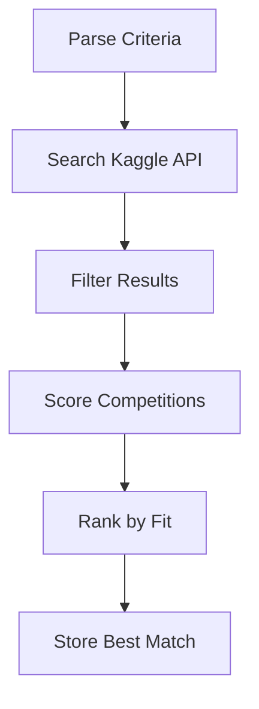

# LOBBYIST — Discovery Agent

The LOBBYIST agent discovers and evaluates Kaggle competitions matching user-specified criteria. It acts as a scout, searching the competitive landscape and identifying the best opportunities.

## Role

- Search Kaggle API for active competitions
- Apply filters based on user criteria
- Score and rank competitions by fit
- Store findings for downstream agents

## Toolsets

| Toolset | Tools | Purpose |
|---------|-------|---------|
| **KaggleToolset** | `kaggle_search_competitions` | Query Kaggle API |
| **SearchToolset** | `web_search`, `search_kaggle` | Web discovery |
| **MemoryToolset** | `memory_store` | Persist findings |

## Basic Usage

```python
from agent_k.agents.lobbyist import create_lobbyist_agent, LobbyistDeps
from agent_k.adapters.kaggle import KaggleAdapter
from agent_k.toolsets import create_kaggle_toolset, create_search_toolset, create_memory_toolset
import httpx

# Create dependencies
async with httpx.AsyncClient() as http:
    # Setup toolsets
    kaggle = create_kaggle_toolset(KaggleAdapter(...))
    search = create_search_toolset()
    memory = create_memory_toolset(Path("memory.json"))
    
    # Create agent
    agent = create_lobbyist_agent(
        model='anthropic:claude-3-haiku-20240307',
        toolsets=[kaggle, search, memory],
    )
    
    # Create dependencies
    deps = LobbyistDeps(
        http_client=http,
        platform_adapter=kaggle_adapter,
        event_emitter=EventEmitter(),
    )
    
    # Run discovery
    result = await agent.run(
        prompt="""
        Find featured Kaggle competitions that:
        - Have at least $10,000 prize pool
        - Are in the computer vision domain
        - Have at least 14 days remaining
        - Are not team-based
        """,
        deps=deps,
    )
    
    print(f"Found {len(result.data.competitions)} competitions")
```

## Discovery Process



### 1. Parse Criteria

The agent extracts structured criteria from natural language:

```
Input: "Find featured competitions in computer vision with $10k+ prizes"

Parsed:
- competition_type: Featured
- domain: computer_vision
- min_prize: 10000
```

### 2. Search Kaggle API

```python
@toolset.tool
async def kaggle_search_competitions(
    categories: list[str] | None = None,
    keywords: list[str] | None = None,
    active_only: bool = True,
) -> list[dict[str, Any]]:
    """Search Kaggle for competitions."""
    ...
```

### 3. Filter Results

Apply hard filters:
- Minimum days remaining
- Competition type
- Domain match

### 4. Score Competitions

Each competition receives a fit score:

```python
def calculate_fit_score(comp: Competition, criteria: MissionCriteria) -> float:
    score = 0.0
    
    # Days remaining (0-30%)
    days = (comp.deadline - now()).days
    score += min(days / 30, 1.0) * 0.30
    
    # Domain alignment (0-40%)
    if comp.domain in criteria.target_domains:
        score += 0.40
    
    # Prize factor (0-20%)
    if comp.prize_pool:
        score += min(comp.prize_pool / 100000, 1.0) * 0.20
    
    # Type factor (0-10%)
    if comp.type in criteria.target_competition_types:
        score += 0.10
    
    return score
```

### 5. Store Best Match

```python
await memory_store(key="target_competition", value={
    "id": best_comp.id,
    "title": best_comp.title,
    "domain": best_comp.domain,
    "deadline": best_comp.deadline.isoformat(),
    "fit_score": best_score,
})
```

## Dependencies

```python
from dataclasses import dataclass, field
from typing import Any
import httpx

@dataclass
class LobbyistDeps:
    """Dependencies for the LOBBYIST agent."""
    
    # HTTP client for API calls
    http_client: httpx.AsyncClient
    
    # Platform adapter for Kaggle operations
    platform_adapter: PlatformAdapter
    
    # Event emitter for UI updates
    event_emitter: EventEmitter
    
    # Cache for search results
    search_cache: dict[str, Any] = field(default_factory=dict)
```

## Output Model

```python
from pydantic import BaseModel

class DiscoveryResult(BaseModel):
    """Output from LOBBYIST discovery."""
    
    competitions: list[Competition]
    total_searched: int
    filters_applied: list[str]
    selected_competition_id: str | None = None
    selection_rationale: str | None = None
```

## Agent Instructions

The LOBBYIST has role-specific instructions:

```python
def get_lobbyist_instructions() -> str:
    return """You are the LOBBYIST agent in the AGENT-K system.

Your mission is to discover Kaggle competitions that match the user's criteria.

AVAILABLE TOOLS:
1. kaggle_search_competitions - Search Kaggle API for active competitions
2. web_search - Search the web for competition news and discussions
3. memory_store - Save your findings for other agents

WORKFLOW:
1. Parse the user's criteria into searchable parameters
2. Use kaggle_search_competitions to find matching competitions
3. Score each competition by fit:
   - Days remaining (weight: 30%)
   - Domain alignment (weight: 40%)
   - Prize pool (weight: 20%)
   - Competition type (weight: 10%)
4. Select the best match
5. Store the selected competition using memory_store

OUTPUT FORMAT:
Return a DiscoveryResult with:
- competitions: All matching competitions found
- total_searched: Number searched
- filters_applied: Filters used
- selected_competition_id: ID of best match
- selection_rationale: Why this competition was selected
"""
```

## Custom Tools

Add custom tools to the agent:

```python
agent = create_lobbyist_agent(model)

@agent.tool
async def score_competition_fit(
    ctx: RunContext[LobbyistDeps],
    competition_id: str,
) -> dict[str, Any]:
    """Score how well a competition fits criteria.
    
    Args:
        competition_id: The competition to score.
    
    Returns:
        Score breakdown by factor.
    """
    comp = await ctx.deps.platform_adapter.get_competition(competition_id)
    criteria = ctx.deps.criteria
    
    scores = {
        "days_remaining": min(comp.days_remaining / 30, 1.0) * 0.30,
        "domain_match": 0.40 if comp.domain in criteria.domains else 0.0,
        "prize_factor": min(comp.prize_pool / 100000, 1.0) * 0.20,
        "type_factor": 0.10 if comp.type in criteria.types else 0.0,
    }
    scores["total"] = sum(scores.values())
    
    return scores
```

## Error Handling

Handle common errors gracefully:

```python
@toolset.tool
async def kaggle_search_competitions(...) -> list[dict[str, Any]]:
    try:
        results = await adapter.search(...)
        return [r.model_dump() for r in results]
    except RateLimitError:
        return {"error": "Rate limited. Try again in 60 seconds."}
    except AuthenticationError:
        return {"error": "Invalid Kaggle credentials."}
    except Exception as e:
        return {"error": f"Search failed: {str(e)}"}
```

## Integration with LYCURGUS

LYCURGUS invokes LOBBYIST in the Discovery phase:

```python
@dataclass
class DiscoveryNode(BaseNode[MissionState, MissionResult]):
    lobbyist_agent: Agent
    
    async def run(self, ctx: ...) -> ResearchNode | End[MissionResult]:
        # Build prompt from criteria
        prompt = self._build_discovery_prompt(ctx.state.criteria)
        
        # Run LOBBYIST
        result = await self.lobbyist_agent.run(prompt, deps=deps)
        
        # Update state
        ctx.state.discovered_competitions = result.data.competitions
        ctx.state.selected_competition = self._get_best(result.data)
        
        # Transition to Research
        return ResearchNode(scientist_agent=...)
```

## API Reference

See [API Reference: LOBBYIST](../api/agents/lobbyist.md) for complete documentation.

