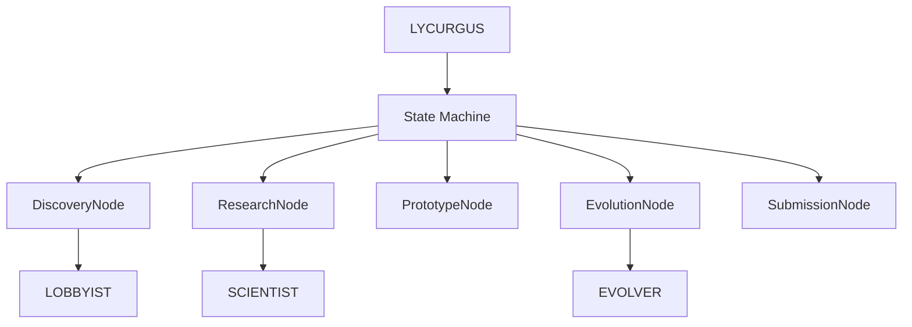

# LYCURGUS — Orchestrator Agent

LYCURGUS is the central orchestrator that coordinates the multi-agent mission lifecycle. Named after the legendary Spartan lawgiver, it establishes the rules and order for how agents collaborate.

## Role

- Initialize and configure specialized agents
- Execute the state machine graph
- Manage phase transitions
- Handle error recovery and retries
- Emit events for UI dashboard

## Architecture



## Basic Usage

```python
from agent_k.agents.lycurgus import LycurgusOrchestrator
from agent_k.core.models import MissionCriteria, CompetitionType

async def run_mission():
    async with LycurgusOrchestrator() as orchestrator:
        result = await orchestrator.execute_mission(
            competition_id="titanic",
            criteria=MissionCriteria(
                target_leaderboard_percentile=0.10,
            ),
        )
        
        if result.success:
            print(f"✅ Mission complete!")
            print(f"Final rank: {result.final_rank}")
            print(f"Final score: {result.final_score}")
        else:
            print(f"❌ Mission failed: {result.error_message}")

import asyncio
asyncio.run(run_mission())
```

## Configuration

### OrchestratorConfig

```python
from agent_k.agents.lycurgus import OrchestratorConfig

config = OrchestratorConfig(
    # Model for all agents
    default_model='anthropic:claude-3-haiku-20240307',
    
    # Evolution settings
    max_evolution_rounds=100,
    evolution_timeout_seconds=7200,
    
    # Phase timeouts
    discovery_timeout_seconds=300,
    research_timeout_seconds=600,
    prototype_timeout_seconds=600,
    submission_timeout_seconds=300,
    
    # Retry settings
    max_retries=3,
    retry_delay_seconds=5,
)

orchestrator = LycurgusOrchestrator(config=config)
```

### Using Devstral

For local Devstral:

```python
config = OrchestratorConfig.with_devstral(
    base_url='http://localhost:1234/v1'  # Optional
)
orchestrator = LycurgusOrchestrator(config=config)
```

### Specific Model

```python
orchestrator = LycurgusOrchestrator(model='openrouter:mistralai/devstral-small')
```

## Mission Execution Flow

1. **Initialize Agents**
   ```python
   self._lobbyist = create_lobbyist_agent(model)
   self._scientist = create_scientist_agent(model)
   self._evolver = create_evolver_agent(model)
   ```

2. **Build Graph**
   ```python
   self._graph = Graph(
       nodes=(DiscoveryNode, ResearchNode, PrototypeNode, EvolutionNode, SubmissionNode),
       state_type=MissionState,
   )
   ```

3. **Initialize State**
   ```python
   self._state = MissionState(
       mission_id=str(uuid4()),
       competition_id=competition_id,
       criteria=criteria,
   )
   ```

4. **Execute Graph**
   ```python
   result = await self._graph.run(
       DiscoveryNode(lobbyist_agent=self._lobbyist),
       state=self._state,
   )
   ```

## Event Emission

LYCURGUS emits events for the UI dashboard:

### Phase Events

```python
# Phase start
await self._event_emitter.emit_phase_start(
    phase="discovery",
    objectives=[
        "Search Kaggle for competitions",
        "Apply filters and criteria",
        "Select best match",
    ],
)

# Phase complete
await self._event_emitter.emit_phase_complete(
    phase="discovery",
    success=True,
    duration_ms=elapsed,
)
```

### Progress Events

```python
await self._event_emitter.emit_progress(
    phase="discovery",
    step="Searching Kaggle API...",
    progress=0.3,
)
```

### Error Events

```python
await self._event_emitter.emit_error(
    error_id=f"discovery_{mission_id}",
    category="recoverable",
    message="Rate limited, retrying...",
    recovery_strategy="retry",
)
```

## Error Handling

LYCURGUS implements comprehensive error handling:

### Retry Logic

```python
for attempt in range(self._config.max_retries):
    try:
        result = await self._execute_phase(node)
        break
    except TransientError:
        if attempt < self._config.max_retries - 1:
            await asyncio.sleep(self._config.retry_delay_seconds)
        else:
            raise
```

### Graceful Degradation

If a phase fails but has partial results:

```python
if evolution_state.best_solution:
    # Use best solution found
    return SubmissionNode(solution=evolution_state.best_solution)
else:
    # No viable solution
    return End(MissionResult(success=False, ...))
```

## Accessing Sub-Agents

```python
orchestrator = LycurgusOrchestrator()

# Access individual agents
lobbyist = orchestrator.lobbyist
scientist = orchestrator.scientist
evolver = orchestrator.evolver

# Run individually
result = await lobbyist.run(
    prompt="Find featured competitions",
    deps=deps,
)
```

## Custom Phase Logic

Override phase execution:

```python
class CustomOrchestrator(LycurgusOrchestrator):
    async def _on_discovery_complete(
        self,
        result: DiscoveryResult,
    ) -> None:
        """Hook after discovery completes."""
        # Custom logic
        await self._notify_slack(f"Found {len(result.competitions)} competitions")
    
    async def _on_evolution_progress(
        self,
        generation: int,
        best_fitness: float,
    ) -> None:
        """Hook on each evolution generation."""
        # Custom progress tracking
        await self._log_to_database(generation, best_fitness)
```

## Programmatic Control

### Pause and Resume

```python
# Pause after research
orchestrator.pause_after_phase("research")

# Execute until pause
result = await orchestrator.execute_until_pause()

# Review state
print(orchestrator.state.research_findings)

# Resume
result = await orchestrator.resume()
```

### Skip Phases

```python
# Skip discovery, use known competition
orchestrator = LycurgusOrchestrator()
await orchestrator.set_competition("titanic")

# Start from research
result = await orchestrator.execute_from_phase("research")
```

## Integration with Dashboard

LYCURGUS integrates with the AG-UI protocol:

```python
from agent_k.ui.ag_ui import create_app

app = create_app()

@app.post("/mission/start")
async def start_mission(request: MissionRequest):
    orchestrator = LycurgusOrchestrator(
        model=request.model,
        event_emitter=SSEEventEmitter(request.client_id),
    )
    
    asyncio.create_task(orchestrator.execute_mission(
        competition_id=request.competition_id,
        criteria=request.criteria,
    ))
    
    return {"status": "started"}
```

## API Reference

See [API Reference: LYCURGUS](../api/agents/lycurgus.md) for complete documentation.

