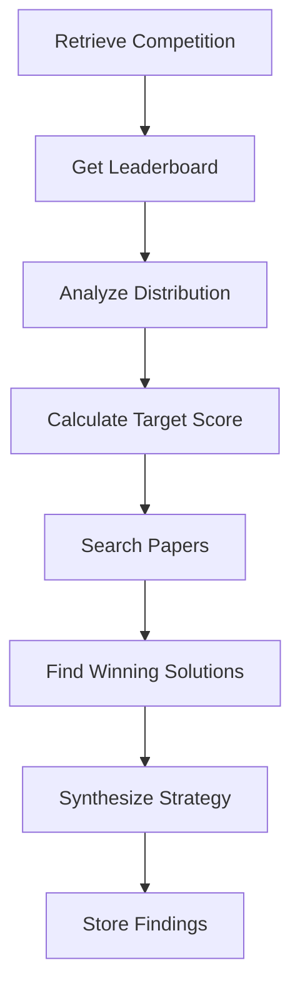

# SCIENTIST — Research Agent

The SCIENTIST agent conducts comprehensive research on the selected competition. It analyzes leaderboards, searches for relevant papers, and synthesizes a winning strategy.

## Role

- Analyze leaderboard score distribution
- Search for relevant academic papers
- Find winning approaches from past competitions
- Synthesize strategic recommendations
- Store findings for EVOLVER

## Toolsets

| Toolset | Tools | Purpose |
|---------|-------|---------|
| **KaggleToolset** | `kaggle_get_leaderboard`, `kaggle_get_competition` | Leaderboard analysis |
| **SearchToolset** | `search_papers`, `search_kaggle`, `web_search` | Research discovery |
| **MemoryToolset** | `memory_retrieve`, `memory_store` | Access and persist findings |

## Basic Usage

```python
from agent_k.agents.scientist import create_scientist_agent, ScientistDeps
from agent_k.toolsets import create_kaggle_toolset, create_search_toolset, create_memory_toolset

# Create agent
agent = create_scientist_agent(
    model='anthropic:claude-3-haiku-20240307',
    toolsets=[kaggle_toolset, search_toolset, memory_toolset],
)

# Create dependencies
deps = ScientistDeps(
    http_client=http,
    platform_adapter=kaggle_adapter,
    event_emitter=EventEmitter(),
)

# Run research
result = await agent.run(
    prompt="""
    Research the competition stored in memory under "target_competition".
    
    Analyze:
    1. Leaderboard score distribution
    2. Target score for top 10%
    3. Relevant papers and techniques
    4. Winning approaches from similar competitions
    
    Synthesize a strategy for achieving top 10%.
    """,
    deps=deps,
)

print(result.data.strategy_recommendations)
```

## Research Process



### 1. Retrieve Competition

```python
competition = await memory_retrieve(key="target_competition")
```

### 2. Get Leaderboard

```python
@toolset.tool
async def kaggle_get_leaderboard(
    competition_id: str,
    page_size: int = 100,
) -> list[dict[str, Any]]:
    """Get competition leaderboard entries."""
    entries = await adapter.get_leaderboard(competition_id, limit=page_size)
    return [e.model_dump() for e in entries]
```

### 3. Analyze Distribution

Calculate statistics from leaderboard:

```python
leaderboard = await kaggle_get_leaderboard(comp_id)

scores = [entry["score"] for entry in leaderboard]
analysis = {
    "top_score": max(scores),
    "median_score": median(scores),
    "p90_score": percentile(scores, 90),
    "p10_score": percentile(scores, 10),
    "std_dev": std(scores),
}
```

### 4. Calculate Target Score

```python
def get_target_score(
    leaderboard: list[dict],
    target_percentile: float,
) -> float:
    """Calculate score needed for target percentile."""
    scores = sorted([e["score"] for e in leaderboard], reverse=True)
    target_rank = int(len(scores) * target_percentile)
    return scores[target_rank]
```

### 5. Search Papers

```python
@toolset.tool
async def search_papers(
    query: str,
    max_results: int = 10,
) -> list[dict[str, Any]]:
    """Search academic papers."""
    ...
```

### 6. Find Winning Solutions

```python
@toolset.tool
async def search_kaggle(
    query: str,
    search_type: str = "discussions",
) -> list[dict[str, Any]]:
    """Search Kaggle discussions and notebooks."""
    ...
```

### 7. Synthesize Strategy

The agent combines findings into actionable recommendations.

### 8. Store Findings

```python
await memory_store(key="research_findings", value={
    "leaderboard_analysis": analysis,
    "papers": papers,
    "approaches": approaches,
    "strategy_recommendations": recommendations,
})
```

## Output Model

```python
class ResearchFindings(BaseModel):
    """Output from SCIENTIST research."""
    
    leaderboard_analysis: LeaderboardAnalysis
    papers: list[Paper]
    approaches: list[ApproachSummary]
    strategy_recommendations: list[str]
    key_techniques: list[str]
    potential_pitfalls: list[str]

class LeaderboardAnalysis(BaseModel):
    """Leaderboard statistics."""
    
    total_entries: int
    top_score: float
    median_score: float
    target_score: float
    target_percentile: float
    score_distribution: dict[str, float]
```

## Agent Instructions

```python
def get_scientist_instructions() -> str:
    return """You are the SCIENTIST agent in the AGENT-K system.

Your mission is to conduct comprehensive research on a Kaggle competition.

AVAILABLE TOOLS:
1. memory_retrieve - Get competition from LOBBYIST
2. kaggle_get_leaderboard - Analyze current standings
3. search_papers - Find relevant academic papers
4. search_kaggle - Find winning solutions from past competitions
5. web_search - Search for tips and discussions
6. memory_store - Save your findings

WORKFLOW:
1. Retrieve the target competition: memory_retrieve("target_competition")
2. Get and analyze the leaderboard
3. Calculate target score for user's percentile goal
4. Search for relevant papers and techniques
5. Find winning approaches from similar competitions
6. Synthesize strategy recommendations
7. Store findings: memory_store("research_findings", {...})

ANALYSIS FOCUS:
- What separates top performers from average?
- What techniques are commonly used?
- What are common mistakes to avoid?
- What is the minimum viable solution?
- What innovations could provide edge?
"""
```

## Leaderboard Analysis

The SCIENTIST performs detailed leaderboard analysis:

```python
async def analyze_leaderboard(
    leaderboard: list[dict],
    target_percentile: float,
) -> LeaderboardAnalysis:
    scores = [e["score"] for e in leaderboard]
    
    return LeaderboardAnalysis(
        total_entries=len(scores),
        top_score=max(scores),
        median_score=median(scores),
        target_score=get_target_score(leaderboard, target_percentile),
        target_percentile=target_percentile,
        score_distribution={
            "p99": percentile(scores, 99),
            "p95": percentile(scores, 95),
            "p90": percentile(scores, 90),
            "p75": percentile(scores, 75),
            "p50": percentile(scores, 50),
            "p25": percentile(scores, 25),
        },
    )
```

## Paper Search

The SCIENTIST searches for relevant academic papers:

```python
# Search by competition topic
papers = await search_papers(
    query="Titanic survival prediction machine learning",
    max_results=10,
)

# Search by technique
technique_papers = await search_papers(
    query="gradient boosting ensemble methods tabular data",
    max_results=5,
)
```

## Winning Solution Analysis

Extract insights from winning solutions:

```python
# Search past competition winners
winners = await search_kaggle(
    query="Titanic winning solution",
    search_type="discussions",
)

# Extract techniques
techniques = []
for winner in winners:
    if "feature engineering" in winner["content"].lower():
        techniques.append("feature_engineering")
    if "ensemble" in winner["content"].lower():
        techniques.append("ensemble")
    # ...
```

## Strategy Synthesis

The agent synthesizes findings into actionable strategy:

```
Based on research:

STRATEGY RECOMMENDATIONS:
1. Use ensemble of gradient boosting models (XGBoost + LightGBM)
2. Focus on feature engineering:
   - Family size features
   - Title extraction from names
   - Cabin deck features
3. Handle missing values:
   - Age: Impute with median by class
   - Embarked: Most frequent
4. Cross-validation strategy:
   - 5-fold stratified
   - Monitor for overfitting

KEY TECHNIQUES:
- Gradient boosting
- Feature engineering
- Ensemble methods

POTENTIAL PITFALLS:
- Overfitting to train set
- Ignoring class imbalance
- Leaking test information
```

## Integration with LYCURGUS

```python
@dataclass
class ResearchNode(BaseNode[MissionState, MissionResult]):
    scientist_agent: Agent
    
    async def run(self, ctx: ...) -> PrototypeNode | End[MissionResult]:
        # Build prompt
        prompt = f"""
        Research competition: {ctx.state.selected_competition.id}
        Target percentile: {ctx.state.criteria.target_leaderboard_percentile}
        
        Analyze leaderboard and develop strategy.
        """
        
        # Run SCIENTIST
        result = await self.scientist_agent.run(prompt, deps=deps)
        
        # Update state
        ctx.state.research_findings = result.data
        
        # Transition to Prototype
        return PrototypeNode(...)
```

## API Reference

See [API Reference: SCIENTIST](../api/agents/scientist.md) for complete documentation.

