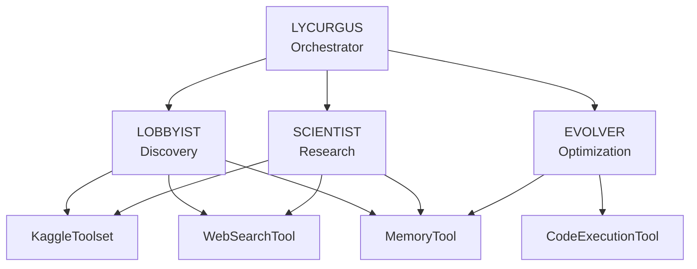

# Multi-Agent Architecture

AGENT-K uses a multi-agent architecture where specialized agents collaborate to complete Kaggle competition missions. Each agent has a specific role and uses tools to accomplish its objectives.

## Overview



## The Agents

### LYCURGUS (Orchestrator)

The central coordinator that manages the mission lifecycle using a [pydantic-graph](https://ai.pydantic.dev/graph/) state machine.

**Responsibilities:**

- Initialize and configure specialized agents
- Execute the state machine graph
- Handle phase transitions
- Manage error recovery and retries

```python
from agent_k.agents.lycurgus import LycurgusOrchestrator

async with LycurgusOrchestrator() as orchestrator:
    result = await orchestrator.execute_mission(
        competition_id="titanic",
        criteria=criteria,
    )
```

### LOBBYIST (Discovery)

Discovers and evaluates Kaggle competitions matching user-specified criteria.

**Tools Used:**

- `kaggle_search_competitions` — Query Kaggle API for active competitions
- `web_search` — Built-in web search for competition news and discussions
- `memory` — Built-in MemoryTool for shared notes (create/view)

**Discovery Process:**

1. Parse natural language criteria
2. Search Kaggle API for matching competitions
3. Score competitions based on fit (deadline, prize, domain)
4. Store best candidate for SCIENTIST

### SCIENTIST (Research)

Conducts comprehensive research on the selected competition.

**Tools Used:**

- `kaggle_get_leaderboard` — Analyze current standings
- `web_search` — Find relevant papers and Kaggle discussions (site-scoped queries)
- `memory` — Built-in MemoryTool for reading and writing research notes

**Research Process:**

1. Retrieve competition from LOBBYIST's findings
2. Analyze leaderboard distribution
3. Search for relevant papers and winning approaches
4. Synthesize strategy recommendations
5. Store findings for EVOLVER

### EVOLVER (Optimization)

Evolves solutions using evolutionary code search.

**Tools Used:**

- `code_execution` — Execute and evaluate candidate solutions (built-in)
- `memory` — Built-in MemoryTool for retrieving research notes

**Evolution Process:**

1. Initialize population from prototype
2. Evaluate fitness of each candidate
3. Apply mutations and crossover
4. Track best solutions
5. Detect convergence

## Agent Singleton Pattern

Each agent is defined once at module level and registered for discovery:

```python
from pydantic_ai import Agent

from agent_k.agents import register_agent
from agent_k.infra.providers import get_model
from .config import LobbyistSettings
from .deps import LobbyistDeps
from .output import DiscoveryResult
from .prompts import LOBBYIST_SYSTEM_PROMPT

settings = LobbyistSettings()

lobbyist_agent: Agent[LobbyistDeps, DiscoveryResult] = Agent(
    model=get_model(settings.model),
    deps_type=LobbyistDeps,
    output_type=DiscoveryResult,
    instructions=LOBBYIST_SYSTEM_PROMPT,
    name='lobbyist',
    model_settings=settings.model_settings,
    retries=settings.tool_retries,
    output_retries=settings.output_retries,
    instrument=True,
)

register_agent('lobbyist', lobbyist_agent)
```

## Dependency Injection

Dependencies are passed to agents using dataclasses:

```python
from dataclasses import dataclass
import httpx

@dataclass
class LobbyistDeps:
    """Dependencies for the LOBBYIST agent."""
    http_client: httpx.AsyncClient
    platform_adapter: PlatformAdapter
    event_emitter: EventEmitter
    search_cache: dict = field(default_factory=dict)
```

This allows:

- **Testability** — Mock dependencies in tests
- **Flexibility** — Swap implementations without changing agent code
- **Type Safety** — Full type checking on dependencies

## Agent Communication

Agents communicate through:

1. **MemoryTool** — Persistent shared notes (file-backed)
2. **State Machine** — Pass data through node transitions
3. **Event Emitter** — Real-time events for UI

```python
# LOBBYIST stores findings
await memory(command=\"create\", path=\"shared/target_competition.md\", file_text=\"Titanic details...\")

# SCIENTIST retrieves them
notes = await memory(command=\"view\", path=\"shared/target_competition.md\")
```

## Agent Instructions

Each agent has a system prompt defining its role and available tools:

```python
def get_lobbyist_instructions() -> str:
    return """You are the LOBBYIST agent in the AGENT-K system.

Your mission is to discover Kaggle competitions matching criteria.

AVAILABLE TOOLS:
- kaggle_search_competitions: Search Kaggle API
- web_search: Built-in web search
- memory: Built-in MemoryTool for shared notes

WORKFLOW:
1. Parse the user's criteria
2. Search Kaggle API for competitions
3. Score competitions by fit
4. Store best candidate for SCIENTIST via MemoryTool
"""
```

## Next Steps

- [State Machine Graph](graph.md) — How phases are orchestrated
- [Toolsets](toolsets.md) — FunctionToolset implementations
- [Model Configuration](models.md) — Supported model providers
