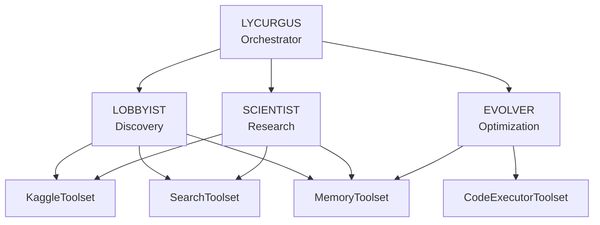

# Multi-Agent Architecture

AGENT-K uses a multi-agent architecture where specialized agents collaborate to complete Kaggle competition missions. Each agent has a specific role and uses tools to accomplish its objectives.

## Overview



## The Agents

### LYCURGUS (Orchestrator)

The central coordinator that manages the mission lifecycle using a [pydantic-graph](https://ai.pydantic.dev/graph/) state machine.

**Responsibilities:**

- Initialize and configure specialized agents
- Execute the state machine graph
- Handle phase transitions
- Manage error recovery and retries

```python
from agent_k.agents.lycurgus import LycurgusOrchestrator

async with LycurgusOrchestrator() as orchestrator:
    result = await orchestrator.execute_mission(
        competition_id="titanic",
        criteria=criteria,
    )
```

### LOBBYIST (Discovery)

Discovers and evaluates Kaggle competitions matching user-specified criteria.

**Tools Used:**

- `kaggle_search_competitions` — Query Kaggle API for active competitions
- `web_search` — Search web for competition news and discussions
- `memory_store` — Save findings for other agents

**Discovery Process:**

1. Parse natural language criteria
2. Search Kaggle API for matching competitions
3. Score competitions based on fit (deadline, prize, domain)
4. Store best candidate for SCIENTIST

### SCIENTIST (Research)

Conducts comprehensive research on the selected competition.

**Tools Used:**

- `kaggle_get_leaderboard` — Analyze current standings
- `search_papers` — Find relevant academic papers
- `search_kaggle` — Find winning solutions from past competitions
- `memory_retrieve` / `memory_store` — Access and save research

**Research Process:**

1. Retrieve competition from LOBBYIST's findings
2. Analyze leaderboard distribution
3. Search for relevant papers and winning approaches
4. Synthesize strategy recommendations
5. Store findings for EVOLVER

### EVOLVER (Optimization)

Evolves solutions using evolutionary code search.

**Tools Used:**

- `code_executor` — Execute and evaluate candidate solutions
- `memory_retrieve` — Get research findings and baseline code

**Evolution Process:**

1. Initialize population from prototype
2. Evaluate fitness of each candidate
3. Apply mutations and crossover
4. Track best solutions
5. Detect convergence

## Agent Factory Pattern

Each agent is created using a factory function that configures the Pydantic-AI Agent:

```python
from pydantic_ai import Agent, RunContext
from agent_k.infra.models import get_model
from agent_k.toolsets import create_kaggle_toolset, create_search_toolset

def create_lobbyist_agent(
    model: str = 'anthropic:claude-3-haiku-20240307',
) -> Agent[LobbyistDeps, DiscoveryResult]:
    """Create and configure the LOBBYIST agent."""
    
    resolved_model = get_model(model)
    
    agent = Agent(
        resolved_model,
        deps_type=LobbyistDeps,
        output_type=DiscoveryResult,
        instructions=get_lobbyist_instructions(),
        toolsets=[kaggle_toolset, search_toolset],
        retries=2,
        name='lobbyist',
    )
    
    # Add custom tools
    @agent.tool
    async def score_competition_fit(
        ctx: RunContext[LobbyistDeps],
        competition_id: str,
    ) -> dict:
        """Score how well a competition fits criteria."""
        ...
    
    return agent
```

## Dependency Injection

Dependencies are passed to agents using dataclasses:

```python
from dataclasses import dataclass
import httpx

@dataclass
class LobbyistDeps:
    """Dependencies for the LOBBYIST agent."""
    http_client: httpx.AsyncClient
    platform_adapter: PlatformAdapter
    event_emitter: EventEmitter
    search_cache: dict = field(default_factory=dict)
```

This allows:

- **Testability** — Mock dependencies in tests
- **Flexibility** — Swap implementations without changing agent code
- **Type Safety** — Full type checking on dependencies

## Agent Communication

Agents communicate through:

1. **Memory Toolset** — Persistent key-value storage
2. **State Machine** — Pass data through node transitions
3. **Event Emitter** — Real-time events for UI

```python
# LOBBYIST stores findings
await memory_store(key="target_competition", value={
    "id": "titanic",
    "title": "Titanic - Machine Learning from Disaster",
    "score": 0.85,
})

# SCIENTIST retrieves them
competition = await memory_retrieve(key="target_competition")
```

## Agent Instructions

Each agent has a system prompt defining its role and available tools:

```python
def get_lobbyist_instructions() -> str:
    return """You are the LOBBYIST agent in the AGENT-K system.

Your mission is to discover Kaggle competitions matching criteria.

AVAILABLE TOOLS:
- kaggle_search_competitions: Search Kaggle API
- web_search: Search the web
- memory_store: Save findings

WORKFLOW:
1. Parse the user's criteria
2. Search Kaggle API for competitions
3. Score competitions by fit
4. Store best candidate for SCIENTIST
"""
```

## Next Steps

- [State Machine Graph](graph.md) — How phases are orchestrated
- [Toolsets](toolsets.md) — FunctionToolset implementations
- [Model Configuration](models.md) — Supported model providers

