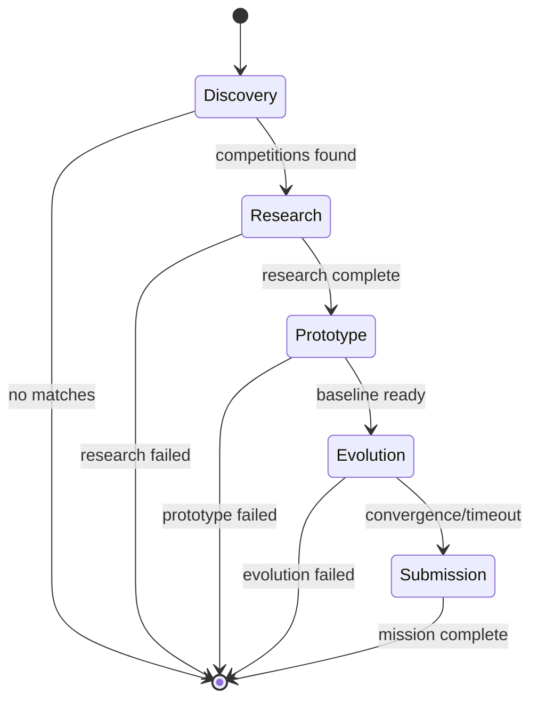

# State Machine Graph

AGENT-K uses [pydantic-graph](https://ai.pydantic.dev/graph/) to orchestrate the mission lifecycle. Each mission phase is a node in a typed state machine that manages transitions, error handling, and state persistence.

## Overview



## Phase Nodes

Each phase is implemented as a `BaseNode` subclass:

```python
from dataclasses import dataclass
from pydantic_graph import BaseNode, End, GraphRunContext

from agent_k.core.models import MissionResult, MissionState
from agent_k.graph.state import GraphContext

@dataclass
class DiscoveryNode(BaseNode[MissionState, MissionResult]):
    """Discovery phase node.
    
    Executes the LOBBYIST agent to find competitions.
    
    Transitions:
        - Success → ResearchNode
        - Failure → End(failure)
    """
    
    lobbyist_agent: Any
    timeout: int = 300
    
    async def run(
        self,
        ctx: GraphRunContext[MissionState, GraphContext],
    ) -> ResearchNode | End[MissionResult]:
        state = ctx.state
        
        # Execute LOBBYIST agent
        result = await self.lobbyist_agent.run(prompt, deps=deps)
        
        if not result.competitions:
            return End(MissionResult(
                success=False,
                error_message="No competitions found",
            ))
        
        # Update state and transition
        state.selected_competition = result.competitions[0]
        return ResearchNode(scientist_agent=self._get_scientist())
```

## The Five Phases

### 1. Discovery Node

**Agent:** LOBBYIST

**Purpose:** Find competitions matching user criteria

**State Updates:**

- `discovered_competitions` — List of matching competitions
- `selected_competition` — Best fit competition

**Transitions:**

- `ResearchNode` — Competitions found
- `End(failure)` — No matches

### 2. Research Node

**Agent:** SCIENTIST

**Purpose:** Analyze competition and develop strategy

**State Updates:**

- `research_findings` — Papers, approaches, EDA results
- `leaderboard_analysis` — Score distribution, target score

**Transitions:**

- `PrototypeNode` — Research complete
- `End(failure)` — Research failed

### 3. Prototype Node

**Agent:** (Code generation)

**Purpose:** Build baseline solution

**State Updates:**

- `prototype_code` — Initial solution code
- `baseline_score` — Initial evaluation score

**Transitions:**

- `EvolutionNode` — Baseline ready
- `End(failure)` — Prototype failed

### 4. Evolution Node

**Agent:** EVOLVER

**Purpose:** Optimize solution through evolutionary search

**State Updates:**

- `evolution_state` — Generation history, best solution
- `convergence_detected` — Whether evolution converged

**Transitions:**

- `SubmissionNode` — Convergence or max generations
- `End(failure)` — Evolution failed (may still submit best)

### 5. Submission Node

**Agent:** (Submission logic)

**Purpose:** Submit final solution to Kaggle

**State Updates:**

- `final_submission_id` — Kaggle submission ID
- `final_score` — Public leaderboard score
- `final_rank` — Final ranking

**Transitions:**

- `End(success)` — Mission complete
- `End(failure)` — Submission failed

## Mission State

The state flows through all nodes:

```python
from pydantic import BaseModel

class MissionState(BaseModel):
    """Complete mission state."""
    
    # Identity
    mission_id: str
    competition_id: str | None = None
    
    # Progress
    current_phase: str | None = None
    phases_completed: list[str] = []
    
    # Phase results
    discovered_competitions: list[Competition] = []
    selected_competition: Competition | None = None
    research_findings: ResearchFindings | None = None
    prototype_code: str | None = None
    evolution_state: EvolutionState | None = None
    
    # Final results
    final_score: float | None = None
    final_rank: int | None = None
```

## Graph Context

Dependencies are passed via the graph context:

```python
from dataclasses import dataclass
import httpx

@dataclass
class GraphContext:
    """Dependencies available to all nodes."""
    http_client: httpx.AsyncClient
    platform_adapter: PlatformAdapter
    event_emitter: EventEmitter
```

## Building the Graph

The orchestrator builds the graph from node classes:

```python
from pydantic_graph import Graph

def _build_orchestration_graph(self) -> Graph[MissionState, MissionResult]:
    return Graph(
        nodes=(
            DiscoveryNode,
            ResearchNode,
            PrototypeNode,
            EvolutionNode,
            SubmissionNode,
        ),
        state_type=MissionState,
    )
```

## Running the Graph

```python
async def _run_graph(self) -> MissionResult:
    """Execute the orchestration graph."""
    # Start with Discovery
    node = DiscoveryNode(lobbyist_agent=self._agents['lobbyist'])
    
    # Run until End
    return await self._graph.run(node, state=self._state)
```

## Error Handling

Nodes can handle errors and emit recovery events:

```python
async def run(self, ctx: GraphRunContext[...]) -> ...:
    try:
        result = await self.agent.run(prompt, deps=deps)
        return NextNode(...)
    except Exception as e:
        # Emit error event
        await ctx.deps.event_emitter.emit_error(
            error_id=f"discovery_{state.mission_id}",
            category="recoverable",
            message=str(e),
            recovery_strategy="retry",
        )
        
        # Return failure
        return End(MissionResult(
            success=False,
            error_message=f"Discovery failed: {e}",
        ))
```

## Event Emission

Nodes emit events for the UI dashboard:

```python
# Phase start
await emitter.emit_phase_start(
    phase="discovery",
    objectives=[
        "Find competitions matching criteria",
        "Validate accessibility",
        "Rank by fit score",
    ],
)

# Phase complete
await emitter.emit_phase_complete(
    phase="discovery",
    success=True,
    duration_ms=elapsed,
)
```

## Next Steps

- [Toolsets](toolsets.md) — Tools available to agents
- [Model Configuration](models.md) — Supported model providers
- [Mission Lifecycle](mission-lifecycle.md) — Detailed phase descriptions

