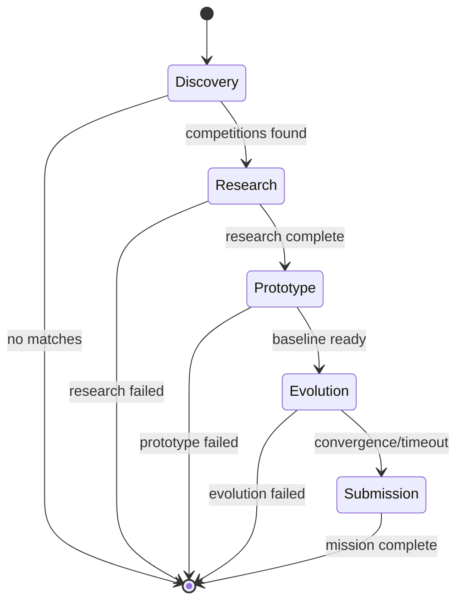

# State Machine Graph

AGENT-K uses [pydantic-graph](https://ai.pydantic.dev/graph/) to orchestrate the mission lifecycle. Each phase is a node in a typed state machine that manages transitions and mission state.

## Overview



## Phase Nodes

Each phase is implemented as a `BaseNode` subclass:

```python
from dataclasses import dataclass
from pydantic_graph import BaseNode, End, GraphRunContext

from agent_k.mission.state import GraphContext, MissionResult, MissionState

@dataclass
class DiscoveryNode(BaseNode[MissionState, GraphContext, MissionResult]):
    """Discovery phase node."""

    lobbyist_agent: Any

    async def run(
        self,
        ctx: GraphRunContext[MissionState, GraphContext],
    ) -> "ResearchNode" | End[MissionResult]:
        state = ctx.state
        result = await self.lobbyist_agent.run(prompt, deps=deps)

        if not result.competitions:
            return End(MissionResult(success=False, mission_id=state.mission_id))

        state.selected_competition = result.competitions[0]
        return ResearchNode(scientist_agent=self._get_scientist())
```

## The Five Phases

### 1. Discovery

Agent: LOBBYIST

State updates:

- `discovered_competitions`
- `selected_competition`

### 2. Research

Agent: SCIENTIST

State updates:

- `research_findings`

### 3. Prototype

Purpose: generate baseline solution code and evaluate it.

State updates:

- `prototype_code`
- `prototype_score`

### 4. Evolution

Agent: EVOLVER

State updates:

- `evolution_state`

### 5. Submission

Purpose: submit final solution through the platform adapter.

State updates:

- `final_submission_id`
- `final_score`
- `final_rank`

## Mission State

The state flows through all nodes:

```python
from pydantic import BaseModel

class MissionState(BaseModel):
    """Mission state snapshot."""

    mission_id: str
    competition_id: str | None = None

    current_phase: str = "discovery"
    phases_completed: list[str] = []

    discovered_competitions: list[Competition] = []
    selected_competition: Competition | None = None
    research_findings: ResearchFindings | None = None
    prototype_code: str | None = None
    prototype_score: float | None = None
    evolution_state: EvolutionState | None = None

    final_submission_id: str | None = None
    final_score: float | None = None
    final_rank: int | None = None
```

## Graph Context

Dependencies are passed via the graph context:

```python
from dataclasses import dataclass
import httpx

@dataclass
class GraphContext:
    """Dependencies available to all nodes."""
    event_emitter: EventEmitter | None = None
    http_client: httpx.AsyncClient | None = None
    platform_adapter: PlatformAdapter | None = None
```

## Building the Graph

The orchestrator builds the graph from node classes:

```python
from pydantic_graph import Graph
from agent_k.mission.nodes import DiscoveryNode, ResearchNode, PrototypeNode, EvolutionNode, SubmissionNode
from agent_k.mission.state import MissionState

graph = Graph(
    nodes=(DiscoveryNode, ResearchNode, PrototypeNode, EvolutionNode, SubmissionNode),
    state_type=MissionState,
)
```
