# Mission Lifecycle

An AGENT-K mission executes through five phases. The LYCURGUS orchestrator runs these phases as a pydantic-graph state machine and updates a shared `MissionState` along the way.

## Overview

```mermaid
graph LR
    subgraph Discovery
        D1[Search Kaggle API]
        D2[Web search for context]
        D3[Score and rank competitions]
    end

    subgraph Research
        R1[Analyze leaderboard]
        R2[Review notebooks and papers]
        R3[Summarize findings]
    end

    subgraph Prototype
        P1[Download data]
        P2[Generate baseline code]
        P3[Execute and score]
    end

    subgraph Evolution
        E1[Initialize population]
        E2[Evaluate fitness]
        E3[Mutate and crossover]
        E4[Detect convergence]
    end

    subgraph Submission
        S1[Submit predictions]
        S2[Fetch final score]
        S3[Record rank]
    end

    Discovery --> Research --> Prototype --> Evolution --> Submission
```



## Phase 1: Discovery

Agent: LOBBYIST

Objective: find competitions matching user criteria.

Process highlights:

- Uses Kaggle toolset to list competitions.
- Uses built-in `web_search` for additional context.
- Scores competitions by prize, domain match, and time remaining.
- Selects the best competition for the mission.

State updates:

- `discovered_competitions`
- `selected_competition`

Output:

```python
DiscoveryResult(
    competitions=[...],
    total_searched=25,
    filters_applied=["featured", "active"],
)
```

## Phase 2: Research

Agent: SCIENTIST

Objective: analyze the competition and produce strategy recommendations.

Process highlights:

- Fetches leaderboard entries.
- Finds notebooks and research papers.
- Summarizes dataset characteristics.

State updates:

- `research_findings`

Output (from SCIENTIST):

```python
ResearchReport(
    competition_id="titanic",
    recommended_approaches=["gradient_boosting", "feature_engineering"],
)
```

The mission node converts this into a `ResearchFindings` summary stored on the mission state.

## Phase 3: Prototype

Objective: generate a baseline solution and establish a score.

Process highlights:

- Downloads competition data using the platform adapter.
- Locates train/test/sample files and stages them.
- Infers target columns from the sample submission.
- Generates baseline code and executes it.
- Falls back to a simple baseline if execution fails.

State updates:

- `prototype_code`
- `prototype_score`

## Phase 4: Evolution

Agent: EVOLVER

Objective: improve the prototype solution with evolutionary search.

Process highlights:

- Builds an initial population from the baseline.
- Evaluates candidates with `evaluate_fitness`.
- Applies `mutate_solution` and `check_convergence` tools.
- Uses Kaggle MCP for submissions when enabled.

State updates:

- `evolution_state`

## Phase 5: Submission

Objective: submit the best solution and capture results.

Process highlights:

- Submits the best candidate using the platform adapter.
- Polls for final leaderboard scores.

State updates:

- `final_submission_id`
- `final_score`
- `final_rank`

## Platform Adapters

If Kaggle credentials are present, the mission uses the Kaggle API. Otherwise it falls back to the OpenEvolve in-memory adapter for offline runs.
