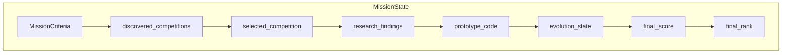

# Mission Lifecycle

An AGENT-K mission executes through five phases, each handled by a specialized agent. This document details what happens in each phase.

## Overview

```mermaid
graph LR
    subgraph Discovery
        D1[Search Kaggle API]
        D2[Web search for news]
        D3[Score & rank competitions]
        D4[Select best match]
    end
    
    subgraph Research
        R1[Get leaderboard]
        R2[Search papers]
        R3[Find winning approaches]
        R4[Synthesize strategy]
    end
    
    subgraph Prototype
        P1[Generate baseline code]
        P2[Validate execution]
        P3[Establish baseline score]
    end
    
    subgraph Evolution
        E1[Initialize population]
        E2[Evaluate fitness]
        E3[Apply mutations]
        E4[Detect convergence]
    end
    
    subgraph Submission
        S1[Generate predictions]
        S2[Submit to Kaggle]
        S3[Get final score]
        S4[Record rank]
    end
    
    Discovery --> Research --> Prototype --> Evolution --> Submission
```



## Phase 1: Discovery

**Agent:** LOBBYIST

**Objective:** Find competitions matching user criteria

### Input

```python
MissionCriteria(
    target_competition_types=frozenset({CompetitionType.FEATURED}),
    min_prize_pool=10000,
    min_days_remaining=14,
    target_domains=frozenset({"computer_vision"}),
    target_leaderboard_percentile=0.10,
)
```

### Process

1. **Search Kaggle API**
   ```
   Tool: kaggle_search_competitions
   - Filter by type, active status
   - Get competition metadata
   ```

2. **Web Search**
   ```
   Tool: web_search
   - Find recent Kaggle news
   - Discover trending competitions
   ```

3. **Score Competitions**
   ```
   For each competition:
   - Days remaining score (0-30%)
   - Domain alignment score (0-40%)
   - Prize factor (0-20%)
   - Type factor (0-10%)
   ```

4. **Select Best Match**
   ```
   Tool: memory
   - Create shared/target_competition.md for SCIENTIST
   ```

### Output

```python
DiscoveryResult(
    competitions=[Competition(...)],
    total_searched=25,
    filters_applied=["featured", "active", "min_days:14"],
)
```

### Transitions

- ✅ Competitions found → **Research**
- ❌ No matches → **End (failure)**

---

## Phase 2: Research

**Agent:** SCIENTIST

**Objective:** Analyze competition and develop winning strategy

### Input

- Selected competition from Discovery
- User's target percentile

### Process

1. **Retrieve Competition**
   ```
   Tool: memory (view shared/target_competition.md)
   ```

2. **Analyze Leaderboard**
   ```
   Tool: kaggle_get_leaderboard
   - Get top 100 entries
   - Calculate score distribution
   - Determine target score for percentile
   ```

3. **Search Papers**
   ```
   Tool: web_search (site:arxiv.org OR site:paperswithcode.com)
   - Find relevant academic research
   - Identify state-of-the-art techniques
   ```

4. **Find Winning Solutions**
   ```
   Tool: web_search (site:kaggle.com)
   - Search past competition winners
   - Extract common patterns
   ```

5. **Synthesize Strategy**
   ```
   Tool: memory (create shared/research_findings.md)
   - Recommended approaches
   - Key techniques to try
   - Potential pitfalls
   ```

### Output

```python
ResearchFindings(
    leaderboard_analysis=LeaderboardAnalysis(
        top_score=0.98,
        median_score=0.85,
        target_score=0.92,
        target_percentile=0.10,
    ),
    papers=[...],
    approaches=[...],
    strategy_recommendations=[
        "Use ensemble of gradient boosting models",
        "Feature engineering on passenger relationships",
        "Handle missing values with imputation",
    ],
)
```

### Transitions

- ✅ Research complete → **Prototype**
- ❌ Research failed → **End (failure)**

---

## Phase 3: Prototype

**Objective:** Build baseline solution

### Input

- Competition details
- Research findings
- Strategy recommendations

### Process

1. **Generate Baseline Code**
   ```
   Based on research findings:
   - Data loading and preprocessing
   - Feature engineering
   - Model training
   - Prediction generation
   ```

2. **Validate Execution**
   ```
   Tool: code_executor
   - Run code against sample data
   - Check for errors
   - Verify output format
   ```

3. **Establish Baseline**
   ```
   - Cross-validation score
   - Execution time
   - Memory usage
   ```

### Output

```python
state.prototype_code = """
import pandas as pd
from sklearn.ensemble import GradientBoostingClassifier

def train_and_predict(train_df, test_df):
    # Feature engineering
    ...
    # Model training
    ...
    # Predictions
    return predictions
"""

state.baseline_cv_score = 0.78
```

### Transitions

- ✅ Baseline ready → **Evolution**
- ❌ Prototype failed → **End (failure)**

---

## Phase 4: Evolution

**Agent:** EVOLVER

**Objective:** Optimize solution through evolutionary search

### Input

- Prototype code
- Target score from research
- Max generations

### Process

1. **Initialize Population**
   ```
   - Create variants of prototype
   - Apply initial mutations
   - Population size: 50
   ```

2. **Evaluation Loop**
   ```
   For each generation:
     1. Evaluate fitness of each candidate
     2. Select top performers
     3. Apply mutations
     4. Apply crossover
     5. Check convergence
   ```

3. **Mutation Types**
   ```
   - Point: Small parameter changes
   - Structural: Add/remove components
   - Hyperparameter: Tune model settings
   - Crossover: Combine good solutions
   ```

4. **Convergence Detection**
   ```
   Stop when:
   - Target score achieved
   - No improvement for N generations
   - Max generations reached
   - Time limit exceeded
   ```

### Output

```python
EvolutionState(
    current_generation=45,
    best_solution={
        "code": "...",
        "fitness": 0.91,
    },
    convergence_detected=True,
    convergence_reason="target_achieved",
    generation_history=[
        GenerationMetrics(generation=0, best_fitness=0.78, ...),
        GenerationMetrics(generation=1, best_fitness=0.80, ...),
        ...
    ],
)
```

### Transitions

- ✅ Convergence/timeout → **Submission**
- ⚠️ Failed but has solution → **Submission**
- ❌ No viable solution → **End (failure)**

---

## Phase 5: Submission

**Objective:** Submit final solution to Kaggle

### Input

- Best solution from Evolution (or Prototype)
- Competition ID

### Process

1. **Generate Predictions**
   ```
   - Run best solution on test data
   - Format output for submission
   ```

2. **Submit to Kaggle**
   ```
   Tool: platform_adapter.submit
   - Upload predictions
   - Get submission ID
   ```

3. **Wait for Score**
   ```
   - Poll for evaluation
   - Retrieve public score
   ```

4. **Get Final Rank**
   ```
   Tool: kaggle_get_leaderboard
   - Find position on leaderboard
   ```

### Output

```python
MissionResult(
    success=True,
    mission_id="mission_123",
    competition_id="titanic",
    final_rank=156,
    final_score=0.91,
    total_submissions=12,
    evolution_generations=45,
    duration_ms=3600000,
    phases_completed=["discovery", "research", "prototype", "evolution", "submission"],
)
```

### Transitions

- ✅ Submission successful → **End (success)**
- ❌ Submission failed → **End (failure)**

---

## State Flow



## Error Handling

Each phase can:

1. **Retry** — Transient failures
2. **Fallback** — Use alternative approach
3. **Skip** — Proceed with partial results
4. **Abort** — Critical failure

```python
try:
    result = await agent.run(prompt, deps=deps)
except TransientError:
    # Retry with backoff
except CriticalError:
    return End(MissionResult(success=False, ...))
```

## Next Steps

- [Agents](agents.md) — Detailed agent documentation
- [State Machine Graph](graph.md) — Graph implementation
- [Examples](../examples/multi-agent-demo.md) — See missions in action
