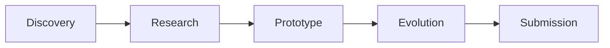

# AGENT-K

<div align="center">
  
  <p><em>Multi-Agent Kaggle Competition Framework</em></p>
</div>

---

**AGENT-K** is an autonomous multi-agent system for discovering, researching, prototyping, evolving, and submitting solutions to Kaggle competitions. Built with [Pydantic-AI](https://ai.pydantic.dev/) and [Pydantic-Graph](https://ai.pydantic.dev/graph/), it orchestrates specialized agents through a 5-phase mission lifecycle.

## Key Features

- **Multi-Agent Orchestration** — Pydantic-Graph state machine coordinates specialized agents
- **Evolutionary Code Search** — Population-based solution optimization with OpenEvolve
- **Kaggle Integration** — FunctionToolset-based platform operations
- **Real-Time Observability** — Pydantic Logfire instrumentation for tracing and metrics
- **Interactive Dashboard** — Next.js frontend with mission monitoring

## The Agents

| Agent | Role | Description |
|-------|------|-------------|
| **LYCURGUS** | Orchestrator | Coordinates the multi-agent lifecycle using a state machine |
| **LOBBYIST** | Discovery | Finds competitions matching criteria via Kaggle API + web search |
| **SCIENTIST** | Research | Analyzes leaderboards, papers, and winning approaches |
| **EVOLVER** | Optimization | Evolves solutions using evolutionary code search |

## Mission Lifecycle



Each phase is implemented as a `BaseNode` in the state machine, returning either the next node or `End[MissionResult]`.

## Quick Example

```python
import asyncio
from agent_k import LycurgusOrchestrator
from agent_k.core.models import MissionCriteria

async def main():
    async with LycurgusOrchestrator() as orchestrator:
        result = await orchestrator.execute_mission(
            competition_id="titanic",
            criteria=MissionCriteria(
                target_leaderboard_percentile=0.10,
                max_evolution_rounds=50,
            ),
        )
        print(f"Final rank: {result.final_rank}")

asyncio.run(main())
```

## Getting Started

<div class="grid cards" markdown>

-   :material-download:{ .lg .middle } **Installation**

    ---

    Install AGENT-K with uv in minutes

    [:octicons-arrow-right-24: Install](install.md)

-   :material-rocket-launch:{ .lg .middle } **Quick Start**

    ---

    Run your first multi-agent mission

    [:octicons-arrow-right-24: Quick Start](quick-start.md)

-   :material-book-open-variant:{ .lg .middle } **Concepts**

    ---

    Understand agents, toolsets, and the graph

    [:octicons-arrow-right-24: Concepts](concepts/agents.md)

-   :material-api:{ .lg .middle } **API Reference**

    ---

    Full API documentation

    [:octicons-arrow-right-24: API Reference](api/agents/lycurgus.md)

</div>

## Technology Stack

### Backend

| Component | Technology |
|-----------|------------|
| Agent Framework | [Pydantic-AI](https://ai.pydantic.dev/) |
| Orchestration | [Pydantic-Graph](https://ai.pydantic.dev/graph/) |
| Observability | [Pydantic Logfire](https://pydantic.dev/logfire) |
| HTTP Client | HTTPX |

### Frontend

| Component | Technology |
|-----------|------------|
| Framework | Next.js 16 |
| Protocol | AG-UI |
| Styling | Tailwind CSS |
| Charts | Recharts |

## Links

- [GitHub Repository](https://github.com/mikewcasale/agent-k)
- [Pydantic-AI Documentation](https://ai.pydantic.dev/)
- [Pydantic Logfire](https://pydantic.dev/logfire)

