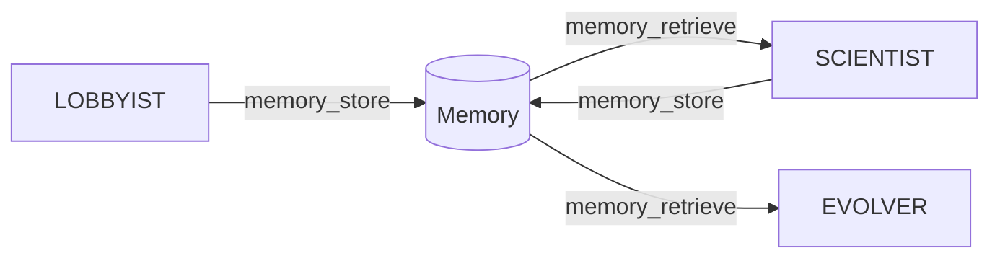

# Memory Toolset

The Memory toolset provides persistent key-value storage for cross-agent communication. This allows agents to share information and maintain state across phases.

## Tools

| Tool | Description |
|------|-------------|
| `memory_store` | Store a value by key |
| `memory_retrieve` | Retrieve a value by key |
| `memory_search` | Search memory by pattern |

## Setup

```python
from pathlib import Path
from agent_k.toolsets import create_memory_toolset

memory_toolset = create_memory_toolset(
    storage_path=Path("mission_memory.json")
)

agent = Agent(
    'anthropic:claude-3-haiku-20240307',
    toolsets=[memory_toolset],
)
```

## Tools Reference

### memory_store

Store a value in persistent memory.

```python
@toolset.tool
async def memory_store(
    key: str,
    value: Any,
) -> dict[str, str]:
    """Store a value in memory.
    
    Args:
        key: Unique key for this value
        value: Any JSON-serializable value
    
    Returns:
        Confirmation message
    """
```

**Example:**

```python
# Store competition
await memory_store(
    key="target_competition",
    value={
        "id": "titanic",
        "title": "Titanic - Machine Learning from Disaster",
        "deadline": "2030-01-01",
    }
)
# Returns: {"status": "stored", "key": "target_competition"}
```

### memory_retrieve

Retrieve a value from memory.

```python
@toolset.tool
async def memory_retrieve(
    key: str,
) -> Any:
    """Retrieve a value from memory.
    
    Args:
        key: Key to retrieve
    
    Returns:
        The stored value, or None if not found
    """
```

**Example:**

```python
# Retrieve competition
competition = await memory_retrieve(key="target_competition")
# Returns: {"id": "titanic", "title": "...", "deadline": "..."}
```

### memory_search

Search memory by key pattern.

```python
@toolset.tool
async def memory_search(
    pattern: str,
) -> list[str]:
    """Search memory for matching keys.
    
    Args:
        pattern: Pattern to match (supports wildcards)
    
    Returns:
        List of matching keys
    """
```

**Example:**

```python
# Find all research keys
keys = await memory_search(pattern="research_*")
# Returns: ["research_findings", "research_papers", "research_approaches"]
```

## Cross-Agent Communication

Memory enables agents to share information:



### Example Flow

1. **LOBBYIST** stores target competition:

```python
await memory_store(
    key="target_competition",
    value={"id": "titanic", "fit_score": 0.92}
)
```

2. **SCIENTIST** retrieves and adds research:

```python
competition = await memory_retrieve("target_competition")

await memory_store(
    key="research_findings",
    value={
        "competition_id": competition["id"],
        "leaderboard_analysis": {...},
        "strategy": [...],
    }
)
```

3. **EVOLVER** retrieves research for evolution:

```python
findings = await memory_retrieve("research_findings")
```

## Storage Backends

### JSON File (Default)

Simple file-based storage:

```python
memory_toolset = create_memory_toolset(
    storage_path=Path("mission_memory.json")
)
```

File format:

```json
{
    "target_competition": {
        "id": "titanic",
        "title": "..."
    },
    "research_findings": {
        "leaderboard_analysis": {...}
    }
}
```

### Redis

For production with multiple instances:

```python
memory_toolset = create_memory_toolset(
    storage_backend="redis",
    redis_url="redis://localhost:6379/0",
)
```

### In-Memory

For testing:

```python
memory_toolset = create_memory_toolset(
    storage_backend="memory",
)
```

## Key Conventions

Use consistent key naming:

| Key Pattern | Description |
|-------------|-------------|
| `target_competition` | Selected competition from LOBBYIST |
| `research_findings` | Research results from SCIENTIST |
| `prototype_code` | Initial solution code |
| `evolution_state` | Current evolution state |
| `best_solution` | Best solution found |

## Namespacing

For multiple missions, use namespaced keys:

```python
mission_id = "mission_123"

await memory_store(
    key=f"{mission_id}:target_competition",
    value={...}
)

# Search by mission
keys = await memory_search(pattern=f"{mission_id}:*")
```

## Memory Persistence

Memory can persist across sessions:

```python
# Create with existing file
memory_toolset = create_memory_toolset(
    storage_path=Path("mission_memory.json"),
    clear_on_start=False,  # Preserve existing data
)

# Or clear on start
memory_toolset = create_memory_toolset(
    storage_path=Path("mission_memory.json"),
    clear_on_start=True,  # Start fresh
)
```

## Memory Size Management

For large values, consider compression:

```python
import json
import gzip
import base64

async def memory_store_compressed(key: str, value: Any):
    """Store compressed value."""
    json_bytes = json.dumps(value).encode()
    compressed = gzip.compress(json_bytes)
    encoded = base64.b64encode(compressed).decode()
    
    await memory_store(key=key, value={"_compressed": encoded})

async def memory_retrieve_decompressed(key: str) -> Any:
    """Retrieve and decompress value."""
    stored = await memory_retrieve(key)
    
    if isinstance(stored, dict) and "_compressed" in stored:
        decoded = base64.b64decode(stored["_compressed"])
        decompressed = gzip.decompress(decoded)
        return json.loads(decompressed)
    
    return stored
```

## Error Handling

```python
@toolset.tool
async def memory_retrieve(key: str) -> Any:
    try:
        value = await storage.get(key)
        if value is None:
            return {"error": f"Key not found: {key}"}
        return value
    except Exception as e:
        return {"error": f"Memory error: {str(e)}"}
```

## Testing

```python
import pytest

@pytest.fixture
def memory_toolset():
    return create_memory_toolset(storage_backend="memory")

async def test_store_and_retrieve(memory_toolset):
    store = memory_toolset.get_tool("memory_store")
    retrieve = memory_toolset.get_tool("memory_retrieve")
    
    await store(key="test", value={"data": 123})
    result = await retrieve(key="test")
    
    assert result == {"data": 123}
```

## API Reference

See [API Reference: MemoryToolset](../api/toolsets/memory.md) for complete documentation.

