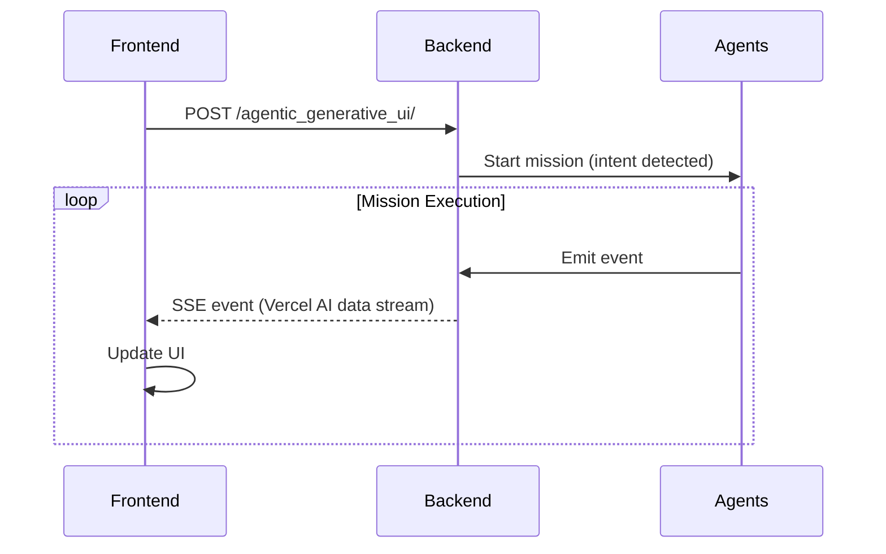

# AG-UI Protocol

AGENT-K uses the AG-UI (Agent-to-UI) protocol for real-time communication between the backend agents and the frontend dashboard. Events are streamed over Server-Sent Events (SSE).

## Overview



## Endpoints

- `GET /health` - Health check
- `POST /api/mission/start` - Create a mission record (no execution) and return `{ \"missionId\": \"...\" }`
- `GET /api/mission/{mission_id}/stream` - SSE stream of mission events
- `GET /api/mission/{mission_id}/status` - Mission status snapshot
- `POST /api/mission/{mission_id}/abort` - Abort a mission
- `POST /agentic_generative_ui/` - Vercel AI compatible chat stream (runs missions when intent is detected)

## Event Types

Events are emitted as `data: {"type": "...", "data": {...}, "timestamp": "..."}`.

Common event types:

- `phase-start`, `phase-complete`, `phase-error`
- `task-start`, `task-progress`, `task-complete`, `task-error`
- `tool-start`, `tool-thinking`, `tool-result`, `tool-error`
- `generation-start`, `generation-complete`
- `submission-result`
- `convergence-detected`
- `memory-store`, `memory-retrieve`
- `checkpoint-created`
- `error-occurred`, `recovery-attempt`, `recovery-complete`
- `mission-complete`

### Example: phase-start

```json
{
  "type": "phase-start",
  "data": {
    "phase": "discovery",
    "objectives": [
      "Find competitions matching criteria",
      "Validate competition accessibility",
      "Rank by fit score"
    ]
  },
  "timestamp": "2025-01-01T00:00:00Z"
}
```

### Example: tool-result

```json
{
  "type": "tool-result",
  "data": {
    "taskId": "kaggle_search",
    "toolCallId": "kaggle_search_abc",
    "result": {"count": 10},
    "durationMs": 250
  },
  "timestamp": "2025-01-01T00:00:03Z"
}
```

### Example: generation-complete

```json
{
  "type": "generation-complete",
  "data": {
    "generation": 5,
    "bestFitness": 0.92,
    "meanFitness": 0.85,
    "worstFitness": 0.62,
    "populationSize": 50,
    "mutations": {"point": 12, "structural": 3}
  },
  "timestamp": "2025-01-01T00:10:00Z"
}
```

### Example: error-occurred

```json
{
  "type": "error-occurred",
  "data": {
    "id": "discovery_mission_123",
    "category": "recoverable",
    "errorType": "RateLimitError",
    "message": "Rate limited by Kaggle API",
    "context": "Discovery phase",
    "recoveryStrategy": "retry",
    "recoveryAttempts": 0,
    "resolved": false
  },
  "timestamp": "2025-01-01T00:00:10Z"
}
```

## Event Emitter

The backend exposes an `EventEmitter` with convenience helpers for emitting events:

```python
from agent_k.ui.ag_ui import EventEmitter

emitter = EventEmitter()
await emitter.emit_phase_start("discovery", ["Search Kaggle", "Rank results"])
await emitter.emit_tool_result("task_1", "tool_1", result={"count": 10}, duration_ms=250)
```

## FastAPI Integration

The FastAPI app is defined in `agent_k.ui.ag_ui` and can be launched via:

```bash
python -m agent_k.ui.ag_ui
```
