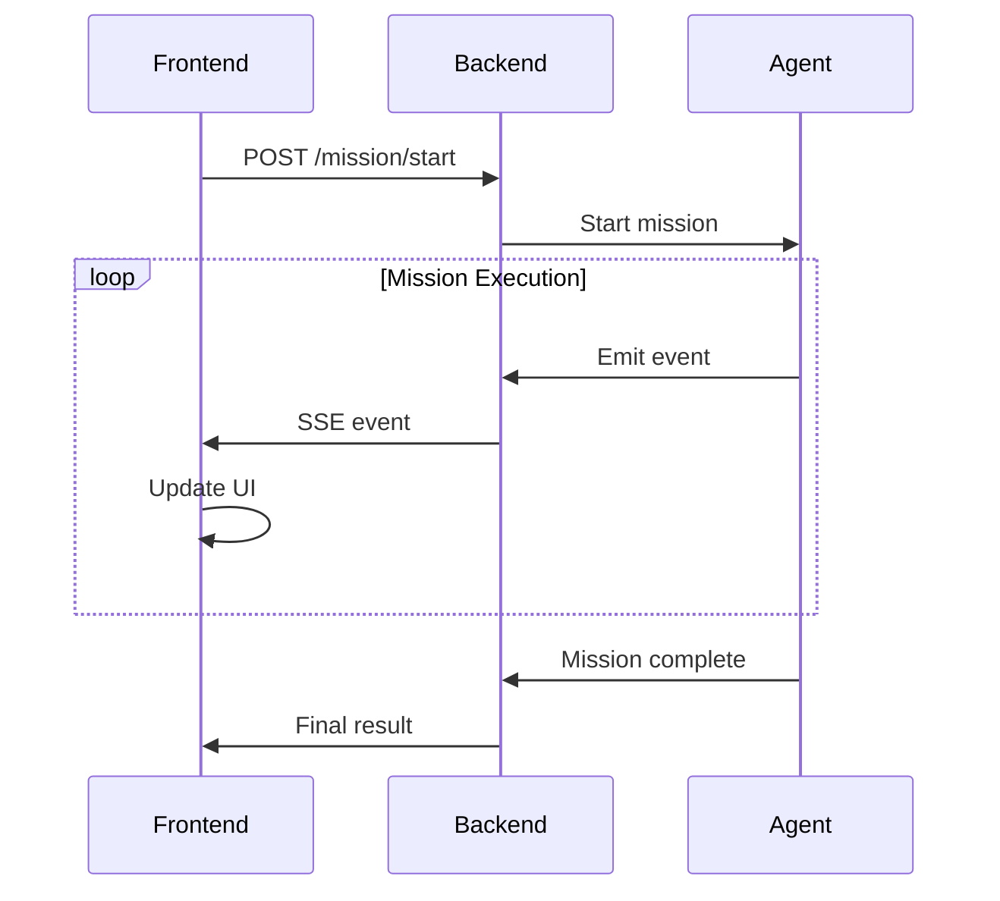

# AG-UI Protocol

AGENT-K uses the AG-UI (Agent-to-UI) protocol for real-time communication between the backend agents and the frontend dashboard. This enables live mission monitoring and interactive control.

## Overview



## Event Types

### Phase Events

```python
# Phase start
{
    "type": "phase_start",
    "data": {
        "phase": "discovery",
        "objectives": [
            "Search Kaggle for competitions",
            "Apply filters",
            "Select best match"
        ],
        "timestamp": "2024-01-01T00:00:00Z"
    }
}

# Phase complete
{
    "type": "phase_complete",
    "data": {
        "phase": "discovery",
        "success": true,
        "duration_ms": 12500,
        "timestamp": "2024-01-01T00:00:12Z"
    }
}
```

### Progress Events

```python
{
    "type": "progress",
    "data": {
        "phase": "discovery",
        "step": "Searching Kaggle API...",
        "progress": 0.3,
        "timestamp": "2024-01-01T00:00:05Z"
    }
}
```

### Tool Call Events

```python
{
    "type": "tool_call",
    "data": {
        "tool_name": "kaggle_search_competitions",
        "arguments": {
            "categories": ["Featured"],
            "active_only": true
        },
        "timestamp": "2024-01-01T00:00:03Z"
    }
}

{
    "type": "tool_result",
    "data": {
        "tool_name": "kaggle_search_competitions",
        "result": [...],
        "duration_ms": 250,
        "timestamp": "2024-01-01T00:00:03Z"
    }
}
```

### Evolution Events

```python
{
    "type": "evolution_progress",
    "data": {
        "generation": 45,
        "best_fitness": 0.91,
        "mean_fitness": 0.85,
        "evaluations": 2250,
        "timestamp": "2024-01-01T01:30:00Z"
    }
}

{
    "type": "new_best",
    "data": {
        "generation": 45,
        "fitness": 0.91,
        "improvement": 0.02,
        "timestamp": "2024-01-01T01:30:00Z"
    }
}
```

### Error Events

```python
{
    "type": "error",
    "data": {
        "error_id": "discovery_mission_123",
        "category": "recoverable",
        "message": "Rate limited by Kaggle API",
        "recovery_strategy": "retry",
        "timestamp": "2024-01-01T00:00:10Z"
    }
}
```

## FastAPI Implementation

### Server Setup

```python
from fastapi import FastAPI, Request
from fastapi.responses import StreamingResponse
from agent_k.ui.ag_ui import create_app, EventEmitter

app = create_app()

@app.get("/health")
async def health():
    return {"status": "healthy"}
```

### SSE Endpoint

```python
from asyncio import Queue

@app.post("/mission/start")
async def start_mission(request: MissionRequest):
    """Start a new mission and return SSE stream."""
    queue: Queue = Queue()
    emitter = QueueEventEmitter(queue)
    
    # Start mission in background
    asyncio.create_task(run_mission(request, emitter))
    
    async def event_generator():
        while True:
            event = await queue.get()
            if event is None:  # End signal
                break
            yield f"data: {json.dumps(event)}\n\n"
    
    return StreamingResponse(
        event_generator(),
        media_type="text/event-stream",
    )
```

### Event Emitter

```python
from dataclasses import dataclass
from asyncio import Queue
import json

@dataclass
class QueueEventEmitter:
    """Emit events to an async queue."""
    
    queue: Queue
    
    async def emit_phase_start(
        self,
        phase: str,
        objectives: list[str],
    ) -> None:
        await self.queue.put({
            "type": "phase_start",
            "data": {
                "phase": phase,
                "objectives": objectives,
                "timestamp": datetime.utcnow().isoformat(),
            }
        })
    
    async def emit_progress(
        self,
        phase: str,
        step: str,
        progress: float,
    ) -> None:
        await self.queue.put({
            "type": "progress",
            "data": {
                "phase": phase,
                "step": step,
                "progress": progress,
                "timestamp": datetime.utcnow().isoformat(),
            }
        })
    
    async def close(self) -> None:
        await self.queue.put(None)
```

## Frontend Consumption

### React Hook

```typescript
import { useEffect, useState } from 'react';

interface AgentEvent {
  type: string;
  data: Record<string, unknown>;
}

export function useAgentEvents(missionId: string) {
  const [events, setEvents] = useState<AgentEvent[]>([]);
  const [connected, setConnected] = useState(false);
  
  useEffect(() => {
    const eventSource = new EventSource(
      `${API_URL}/mission/${missionId}/events`
    );
    
    eventSource.onopen = () => setConnected(true);
    eventSource.onerror = () => setConnected(false);
    
    eventSource.onmessage = (e) => {
      const event = JSON.parse(e.data);
      setEvents(prev => [...prev, event]);
    };
    
    return () => eventSource.close();
  }, [missionId]);
  
  return { events, connected };
}
```

### Event Processing

```typescript
function processEvent(event: AgentEvent, state: MissionState): MissionState {
  switch (event.type) {
    case 'phase_start':
      return {
        ...state,
        currentPhase: event.data.phase as string,
        phaseObjectives: event.data.objectives as string[],
      };
    
    case 'progress':
      return {
        ...state,
        progress: event.data.progress as number,
        currentStep: event.data.step as string,
      };
    
    case 'evolution_progress':
      return {
        ...state,
        evolution: {
          ...state.evolution,
          generation: event.data.generation as number,
          bestFitness: event.data.best_fitness as number,
        },
      };
    
    default:
      return state;
  }
}
```

## API Endpoints

| Endpoint | Method | Description |
|----------|--------|-------------|
| `/health` | GET | Health check |
| `/mission/start` | POST | Start new mission |
| `/mission/{id}/status` | GET | Get mission status |
| `/mission/{id}/events` | GET | SSE event stream |
| `/mission/{id}/stop` | POST | Stop mission |

### Start Mission

```http
POST /mission/start
Content-Type: application/json

{
    "model": "anthropic:claude-3-haiku-20240307",
    "competition_id": "titanic",
    "criteria": {
        "target_leaderboard_percentile": 0.10,
        "max_evolution_rounds": 100
    }
}
```

### Response

```http
HTTP/1.1 200 OK
Content-Type: text/event-stream

data: {"type": "mission_started", "data": {"mission_id": "..."}}

data: {"type": "phase_start", "data": {"phase": "discovery", ...}}

data: {"type": "tool_call", "data": {...}}

...
```

## CORS Configuration

```python
from fastapi.middleware.cors import CORSMiddleware

app.add_middleware(
    CORSMiddleware,
    allow_origins=["http://localhost:3000"],
    allow_credentials=True,
    allow_methods=["*"],
    allow_headers=["*"],
)
```

## Next Steps

- [Dashboard](dashboard.md) — Frontend dashboard components
- [Examples](../examples/multi-agent-demo.md) — See AG-UI in action

