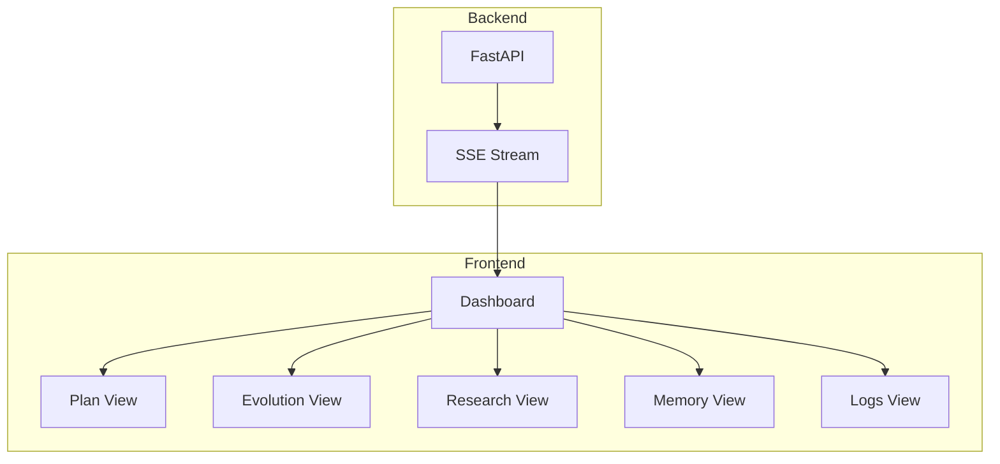

# Frontend Dashboard

The AGENT-K frontend provides a real-time mission monitoring dashboard built with Next.js, featuring live updates via the AG-UI protocol.

## Architecture



## Components

### Mission Dashboard

The main dashboard component orchestrating all views:

```tsx
// frontend/components/agent-k/mission-dashboard.tsx
import { useAgentKState } from '@/hooks/use-agent-k-state';

export function MissionDashboard() {
  const { state, events, connected } = useAgentKState();
  
  return (
    <div className="grid grid-cols-12 gap-4">
      <div className="col-span-3">
        <PlanView phases={state.phases} currentPhase={state.currentPhase} />
      </div>
      <div className="col-span-6">
        <MainView phase={state.currentPhase} data={state} />
      </div>
      <div className="col-span-3">
        <ToolCallsView calls={state.toolCalls} />
      </div>
    </div>
  );
}
```

### Plan View

Shows mission phases and progress:

```tsx
// frontend/components/agent-k/plan-view.tsx
interface Phase {
  id: string;
  name: string;
  status: 'pending' | 'in_progress' | 'complete' | 'failed';
  tasks: Task[];
}

export function PlanView({ phases, currentPhase }: PlanViewProps) {
  return (
    <div className="space-y-4">
      <h2 className="text-lg font-semibold">Mission Plan</h2>
      {phases.map((phase) => (
        <PhaseCard
          key={phase.id}
          phase={phase}
          isCurrent={phase.id === currentPhase}
        />
      ))}
    </div>
  );
}
```

### Evolution View

Displays fitness charts during optimization:

```tsx
// frontend/components/agent-k/evolution-view.tsx
import { LineChart, Line, XAxis, YAxis, Tooltip } from 'recharts';

export function EvolutionView({ history }: EvolutionViewProps) {
  return (
    <div>
      <h2 className="text-lg font-semibold">Evolution Progress</h2>
      <LineChart width={600} height={300} data={history}>
        <XAxis dataKey="generation" />
        <YAxis domain={[0, 1]} />
        <Line
          type="monotone"
          dataKey="bestFitness"
          stroke="#8884d8"
          name="Best"
        />
        <Line
          type="monotone"
          dataKey="meanFitness"
          stroke="#82ca9d"
          name="Mean"
        />
        <Tooltip />
      </LineChart>
      
      <div className="mt-4 grid grid-cols-3 gap-4">
        <Stat label="Generation" value={history.at(-1)?.generation} />
        <Stat label="Best Fitness" value={history.at(-1)?.bestFitness} />
        <Stat label="Evaluations" value={history.at(-1)?.evaluations} />
      </div>
    </div>
  );
}
```

### Research View

Shows findings from the SCIENTIST:

```tsx
// frontend/components/agent-k/research-view.tsx
export function ResearchView({ findings }: ResearchViewProps) {
  return (
    <div className="space-y-6">
      <LeaderboardAnalysis analysis={findings.leaderboardAnalysis} />
      
      <section>
        <h3 className="font-semibold">Strategy Recommendations</h3>
        <ul className="list-disc list-inside">
          {findings.strategyRecommendations.map((rec, i) => (
            <li key={i}>{rec}</li>
          ))}
        </ul>
      </section>
      
      <section>
        <h3 className="font-semibold">Papers Found</h3>
        <PaperList papers={findings.papers} />
      </section>
    </div>
  );
}
```

### Memory View

Shows persistent data across agents:

```tsx
// frontend/components/agent-k/memory-view.tsx
export function MemoryView({ memory }: MemoryViewProps) {
  return (
    <div>
      <h2 className="text-lg font-semibold">Mission Memory</h2>
      <div className="space-y-2">
        {Object.entries(memory).map(([key, value]) => (
          <MemoryEntry key={key} keyName={key} value={value} />
        ))}
      </div>
    </div>
  );
}
```

### Logs View

Real-time agent activity:

```tsx
// frontend/components/agent-k/logs-view.tsx
export function LogsView({ logs }: LogsViewProps) {
  return (
    <div className="font-mono text-sm">
      <h2 className="text-lg font-semibold font-sans">Activity Log</h2>
      <div className="h-96 overflow-y-auto bg-gray-900 p-4 rounded">
        {logs.map((log, i) => (
          <LogEntry key={i} entry={log} />
        ))}
      </div>
    </div>
  );
}
```

## State Management

### useAgentKState Hook

```tsx
// frontend/hooks/use-agent-k-state.tsx
import { useEffect, useReducer } from 'react';

interface MissionState {
  missionId: string | null;
  currentPhase: string | null;
  phases: Phase[];
  evolution: EvolutionState | null;
  research: ResearchFindings | null;
  memory: Record<string, unknown>;
  toolCalls: ToolCall[];
  logs: LogEntry[];
}

export function useAgentKState(missionId?: string) {
  const [state, dispatch] = useReducer(missionReducer, initialState);
  
  useEffect(() => {
    if (!missionId) return;
    
    const eventSource = new EventSource(
      `${API_URL}/mission/${missionId}/events`
    );
    
    eventSource.onmessage = (e) => {
      const event = JSON.parse(e.data);
      dispatch({ type: 'EVENT_RECEIVED', event });
    };
    
    return () => eventSource.close();
  }, [missionId]);
  
  return state;
}
```

### Reducer

```tsx
function missionReducer(state: MissionState, action: Action): MissionState {
  switch (action.type) {
    case 'EVENT_RECEIVED':
      return processEvent(state, action.event);
    case 'RESET':
      return initialState;
    default:
      return state;
  }
}

function processEvent(state: MissionState, event: AgentEvent): MissionState {
  // Process different event types
  switch (event.type) {
    case 'phase-start':
      return updatePhase(state, event.data);
    case 'generation-complete':
      return updateEvolution(state, event.data);
    case 'tool-start':
      return addToolCall(state, event.data);
    // ...
  }
}
```

## Styling

### Tailwind Configuration

```ts
// frontend/tailwind.config.ts
export default {
  theme: {
    extend: {
      colors: {
        'agent-k': {
          primary: '#7c3aed',
          secondary: '#fbbf24',
          background: '#0f172a',
        },
      },
    },
  },
};
```

### Phase Status Colors

```tsx
const statusColors = {
  pending: 'bg-gray-500',
  in_progress: 'bg-blue-500 animate-pulse',
  complete: 'bg-green-500',
  failed: 'bg-red-500',
};
```

## Running the Dashboard

### Development

```bash
cd frontend
pnpm install
pnpm dev
```

Dashboard runs at `http://localhost:3000`.

### Production

```bash
pnpm build
pnpm start
```

## Environment Configuration

```bash
# frontend/.env.local
NEXT_PUBLIC_API_URL=http://localhost:9000
AUTH_SECRET=your-secret-key
```

## Integration with Backend

Ensure the backend is running:

```bash
cd backend
source .venv/bin/activate
python -m agent_k.ui.ag_ui
```

Or start both with:

```bash
./run.sh
```

## Component Structure

```
frontend/components/agent-k/
├── mission-dashboard.tsx     # Main dashboard
├── plan-view.tsx             # Phase/task display
├── evolution-view.tsx        # Fitness charts
├── research-view.tsx         # SCIENTIST findings
├── memory-view.tsx           # Cross-agent memory
├── logs-view.tsx             # Activity log
├── tool-calls-view.tsx       # Tool call display
├── phase-card.tsx            # Individual phase card
├── task-item.tsx             # Individual task item
├── stat.tsx                  # Statistic display
└── connection-status.tsx     # SSE connection indicator
```

## Next Steps

- [AG-UI Protocol](ag-ui.md) — Event types and API
- [Quick Start](../quick-start.md) — Try the dashboard
- [Examples](../examples/multi-agent-demo.md) — Full walkthrough
